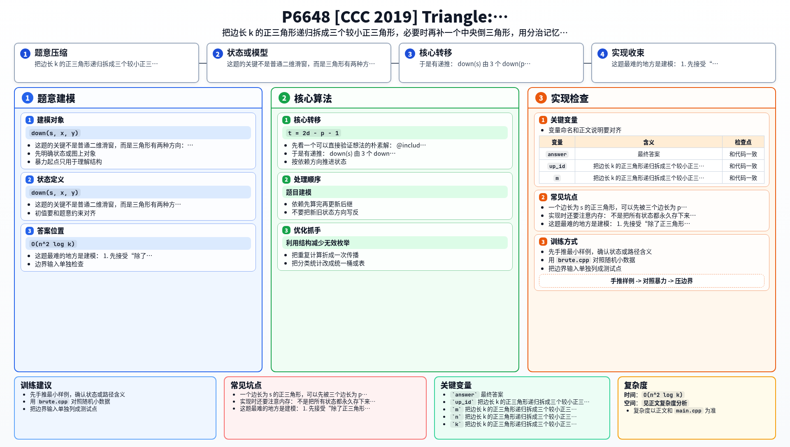

[[TOC]]

### 题意

给定一个边长为 `n` 的数字三角形。

现在固定一个边长 `k`，考虑所有边长为 `k` 的正三角形子三角形。对每个这样的子三角形，取其中数字的最大值，然后把这些最大值全部加起来。

要求输出这个总和。

### 思路

先看一个可以直接验证想法的朴素解：

@include-code(./brute.cpp, cpp)

暴力做法就是枚举每个边长为 `k` 的子三角形，再把里面所有点扫一遍求最大值。这样复杂度大约是 `O(n^2 k^2)`，肯定过不了 `n <= 3000`。

这题的关键不是普通二维滑窗，而是三角形有两种方向：

- 正三角形
- 倒三角形

我们定义：

- `down(s, x, y)`：以 `(x, y)` 为左上角锚点的边长为 `s` 的正三角形最大值
- `up(s, x, y)`：对应位置的边长为 `s` 的倒三角形最大值

设 `p` 是小于 `s` 的最大 `2` 的幂，`d = s - p`。

一个边长为 `s` 的正三角形，可以先被三个边长为 `p` 的正三角形覆盖住三个角：

- 左上角一个
- 左下角一个
- 右下角一个

如果这三个角块还没有完全盖住整个大三角形，那么中间会剩下一块边长为 `t = 2d - p - 1` 的倒三角形，再补上它即可。

于是有递推：

- `down(s)` 由 `3` 个 `down(p)` 和至多 `1` 个 `up(t)` 转移而来
- `up(s)` 同理由 `3` 个 `up(p)` 和至多 `1` 个 `down(t)` 转移而来

因为每次都会把边长降到大约一半，所以递归层数只有 `O(log k)`。把每种需要的边长状态都算一遍，总复杂度就是 `O(n^2 log k)`。

实现时还要注意内存：

- 不是把所有状态都永久存下来
- 而是按边长从小到大计算
- 一个状态如果后面不会再被更大的状态用到，就立刻释放

这样峰值内存可以控制在可接受范围内。

### 代码

@include-code(./main.cpp, cpp)

### 复杂度

- 需要的状态种类数是 `O(log k)`
- 每一层总共处理 `O(n^2)` 个位置

总时间复杂度 `O(n^2 log k)`，空间复杂度为按释放后控制的 `O(n^2 log k)` 峰值内存。

### 总结

这题最难的地方是建模：

1. 先接受“除了正三角形，还要引入倒三角形状态”
2. 再把任意边长递归拆成“三个角块 + 中间补块”
3. 最后再处理工程实现上的内存释放

如果只盯着普通滑动窗口，很容易走偏。

### 一图流解析

这张图把本题的建模、关键转移、实现检查和训练方法压缩到一页，适合读完正文后复盘。

