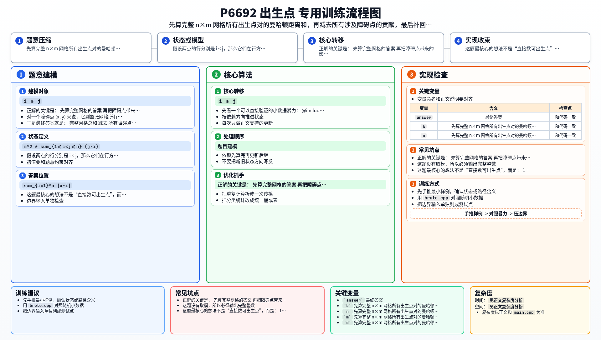

[[TOC]]

### 题意

在一个 `n x m` 的网格里，有 `k` 个障碍点不能出生。

小 W 和小 H 会各自随机出生在一个非障碍点上。  
如果两人交换出生点，视为同一种情况；两人也可以出生在同一个点上。

要求输出：

- 所有合法出生点安排中，两人曼哈顿距离的总和

### 思路

先看一个可以直接验证的小数据暴力：

@include-code(./brute.cpp, cpp)

暴力版先把所有非障碍点列出来，再枚举所有 `i <= j` 的点对，直接累加曼哈顿距离。

正解的关键是：

- 先算完整网格的答案
- 再把障碍点带来的影响修正掉

#### 1. 完整网格的答案

如果没有障碍，那么曼哈顿距离可以拆成横纵两个方向分别统计。

先看行坐标部分。  
假设两点的行分别是 `i < j`，那么它们在行方向贡献：

- `j - i`

而列可以随便选，有 `m^2` 种搭配。  
所以行方向总贡献是：

- `m^2 * sum_{1<=i<j<=n} (j-i)`

同理，列方向总贡献是：

- `n^2 * sum_{1<=i<j<=m} (j-i)`

并且有经典公式：

- `sum_{1<=i<j<=L} (j-i) = L(L-1)(L+1)/6`

于是完整网格总答案可以直接算出来。

#### 2. 删除障碍点

设完整网格点集是 `U`，障碍点集合是 `B`，真正可出生点集合是 `R = U - B`。

我们想要的是：

- `sum_{p,q in R, p<=q} dist(p,q)`

可以从完整答案里扣掉所有“涉及障碍点”的点对。

对一个障碍点 `(x, y)` 来说，它到整张网格所有点的距离和是：

- `m * sum_{i=1}^n |x-i| + n * sum_{j=1}^m |y-j|`

其中：

- `sum_{i=1}^n |x-i|`

可以拆成左边一段和右边一段，直接公式算。

把所有障碍点都这样减掉后，会有一个重复：

- 障碍点之间的点对被减了两次

所以最后还要把“障碍点之间的曼哈顿距离和”补回一次。

#### 3. 最终公式

于是最终答案就是：

- 完整网格总和
- 减去 所有障碍点到整张网格的距离和
- 加上 障碍点之间的无序距离和

障碍点之间的距离和也能拆成 `x` 和 `y` 两部分，排序后用前缀和在线性里算完。

#### 4. 为什么要手写大整数

`n, m` 都能到 `1e9`，答案量级远远超过 `long long`。  
这题没有取模，所以必须输出完整整数。

本地编译环境没有 `boost::multiprecision`，所以代码里手写了一个只支持：

- 加法
- 减法
- 乘小整数
- 除小整数

的非负大整数，已经够用。

### 代码

@include-code(./main.cpp, cpp)

### 复杂度

设障碍数为 `k`。

- 读入并统计障碍对整图贡献：`O(k)`
- 排序并计算障碍点之间距离和：`O(k log k)`

总时间复杂度：

- `O(k log k)`

空间复杂度：

- `O(k)`

### 总结

这题最核心的想法不是“直接数可出生点”，而是：

1. 先算完整网格答案
2. 再按障碍做删点修正

因为障碍只有 `5e5` 个，而整张图可能有 `1e18` 个点，所以必须把复杂度压到只和障碍数有关。

### 一图流解析

这张图把本题的建模、关键转移、实现检查和训练方法压缩到一页，适合读完正文后复盘。

