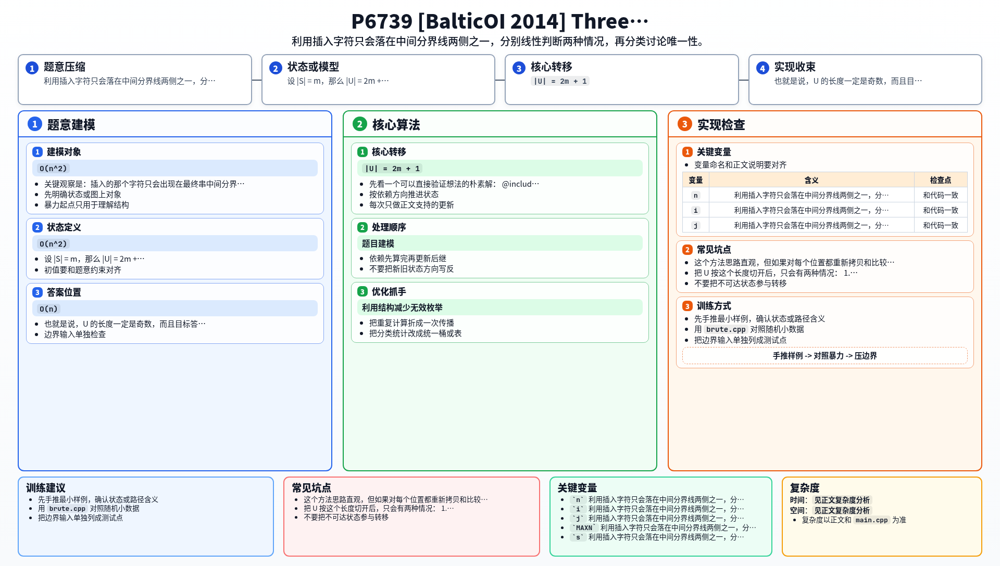

[[TOC]]

### 题意

原串 `S` 先复制一遍，得到 `SS`，然后在某个位置插入一个字符，得到最终串 `U`。

现在只给你 `U`，要求反推出原来的 `S`。

如果不存在这样的 `S`，输出 `NOT POSSIBLE`；  
如果可能的 `S` 不止一个，输出 `NOT UNIQUE`；  
否则输出唯一的那个 `S`。

### 思路

先看一个可以直接验证想法的朴素解：

@include-code(./brute.cpp, cpp)

暴力做法就是枚举删掉 `U` 的哪一个字符，然后检查剩下的串是否恰好能分成两段相同的字符串。这个方法思路直观，但如果对每个位置都重新拷贝和比较，复杂度会到 `O(n^2)`，过不了 `2e6` 的数据范围。

关键观察是：插入的那个字符只会出现在最终串中间分界线附近。

设 `|S| = m`，那么 `|U| = 2m + 1`。  
也就是说，`U` 的长度一定是奇数，而且目标答案长度是 `m = (n - 1) / 2`。

把 `U` 按这个长度切开后，只会有两种情况：

1. 多出来的字符在前半部分  
   也就是 `U[1..m+1]` 删除一个字符后，变成 `U[m+2..2m+1]`
2. 多出来的字符在后半部分  
   也就是 `U[m+1..2m+1]` 删除一个字符后，变成 `U[1..m]`

这两种情况都可以用双指针在线性时间内判断：

- 两段字符相同就一起后移
- 第一次不同时，跳过较长那一段当前字符，视为“删掉插入的字符”
- 如果第二次还不同，就说明这一种情况不成立

最后分类讨论：

- 两种情况都不成立：`NOT POSSIBLE`
- 只有一种成立：答案就是对应的那一半
- 两种都成立：
  - 如果它们得到的答案串相同，输出这个串
  - 否则说明有多个答案，输出 `NOT UNIQUE`

整个过程只需要扫常数次字符串，所以可以做到 `O(n)`。

### 代码

@include-code(./main.cpp, cpp)

### 复杂度

设最终串长度为 `n`。

- 时间复杂度：`O(n)`
- 空间复杂度：`O(n)`，主要是存输入字符串

判断两种情况各扫一遍，再比较一次答案串，都是线性的。

### 总结

这题的核心不是暴力删除哪个字符，而是先看出“多出来的字符只能落在左右两半的分界附近”，从而把所有可能性压缩成两个固定模型。

一旦模型定下来，后面就只是标准的双指针匹配和分类讨论。

### 一图流解析

这张图把本题的建模、关键转移、实现检查和训练方法压缩到一页，适合读完正文后复盘。

