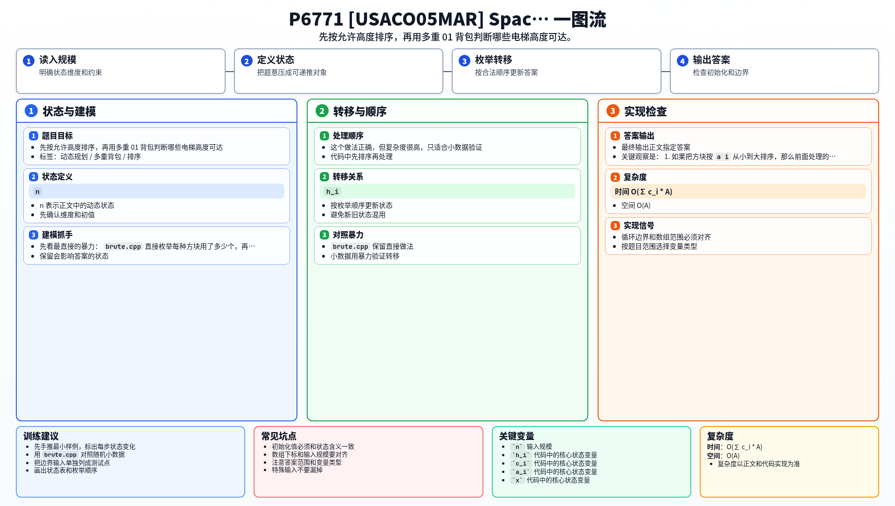

[[TOC]]

### 题意

有 `n` 种方块，每种方块有：

- 高度 `h_i`
- 数量 `c_i`
- 允许到达的最高高度 `a_i`

如果某个方块被放到高度 `x` 的位置，那么它整个方块的最高点不能超过 `a_i`。
因此，只有当当前堆叠高度足够低时，这种方块才能放上去。

目标是堆出尽可能高的太空电梯。

这张表把题意翻成了背包模型：

| 原题对象 | 含义 |
| --- | --- |
| 一种方块 | 有数量上限的物品 |
| 方块高度 | 物品重量 |
| 允许高度 `a_i` | 这类物品的使用上限 |
| 最高可达高度 | 目标答案 |

### 思路

先看最直接的暴力：

@include-code(./brute.cpp, cpp)

`brute.cpp` 直接枚举每种方块用了多少个，再检查最终高度是否超出限制。

这个做法正确，但复杂度很高，只适合小数据验证。

关键观察是：

1. 如果把方块按 `a_i` 从小到大排序，那么前面处理的方块一定不会比后面更“宽松”。
2. 对于某种方块，只能把它放在当前高度不超过 `a_i - h_i` 的位置上。
3. 因为每种方块有数量上限，所以是多重背包。

于是设：

- `dp[h]` 表示当前能否堆出高度 `h`

这张表说明状态定义：

| 状态 | 含义 |
| --- | --- |
| `dp[h]` | 高度 `h` 是否可达 |

对于每种方块：

- 如果它能放上去，就把当前可达高度再加上 `h_i`
- 数量有限，所以同一种方块要重复做 `c_i` 次 0/1 转移

#### DP 公式

设 $dp_h$ 表示当前能否堆出高度 $h$。初始化：

$$
dp_0=true
$$

把每种方块按高度上限从小到大处理。对第 $i$ 种方块，每使用一块高度 $h_i$ 的方块，就做一次 0/1 可达转移：

$$
dp_{x+h_i}\leftarrow dp_{x+h_i}\lor dp_x\quad (x+h_i\le a_i)
$$

最终答案为可达的最大高度：

$$
\max\{h\mid dp_h=true\}
$$

公式解释：每类方块有高度上限和数量上限。按最大允许高度排序后，只在不超过当前上限的位置转移；重复做有限次 0/1 转移就表示数量限制。

### 代码

@include-code(./main.cpp, cpp)

### 复杂度

- 时间复杂度：`O(∑ c_i * A)`，其中 `A` 是最大允许高度
- 空间复杂度：`O(A)`

### 总结

这题的关键是排序：

- 先按 `a_i` 从小到大处理
- 再把“能不能放”转成“当前高度是否足够低”

一旦状态写成“高度是否可达”，问题就变成了一个很标准的多重背包可达性 DP。

### 一图流解析

这张图把本题的建模、关键转移、实现检查和训练方法压缩到一页，适合读完正文后复盘。

