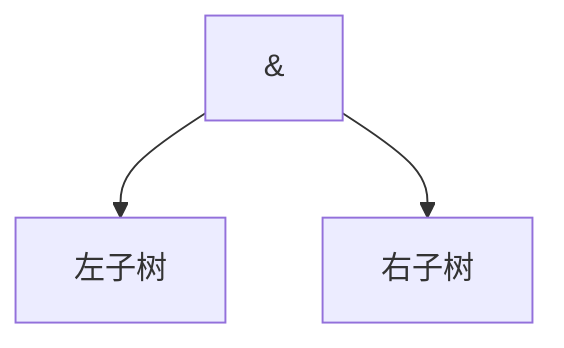
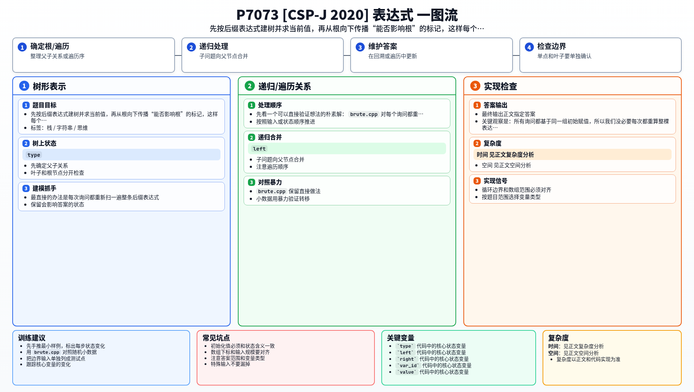

[[TOC]]

### 题意

给出一个后缀表达式，以及每个变量的初始 `0/1` 取值。

每次询问翻转某一个变量的值，其余变量保持初始值不变，问整个表达式的新值。

### 思路

最直接的办法是每次询问都重新扫一遍整条后缀表达式。

先看一个可以直接验证想法的朴素解：

@include-code(./brute.cpp, cpp)

`brute.cpp` 对每个询问都重新模拟一次后缀表达式求值，逻辑简单，但复杂度是 `O(|s| * q)`，显然不够。

关键观察是：所有询问都基于同一组初始赋值，所以我们没必要每次都重算整棵表达式树。

#### 影响传播

这张图展示在一个 `&` 节点里，什么时候左子树还能把影响继续往上传：

如果右子树当前值是 `0`，那么整个 `&` 节点已经被卡死成 `0`，左子树怎么翻都不会影响根。
只有当右子树当前值是 `1` 时，左子树的变化才有机会继续向上传递。
`|` 节点的道理正好反过来，`!` 节点则一定把影响传递下去。

所以正式解分成两步：

1. 先按后缀表达式建出表达式树，并顺手求出每个节点当前值
2. 再从根往下做一次“影响传播”，标记哪些变量翻转后真的能改变根值

因为每个变量只出现一次，所以：

- 如果某个变量能影响根，翻转它后根值一定翻转
- 如果不能影响根，翻转它后根值一定不变

于是每个询问都能 `O(1)` 回答。

### 代码

@include-code(./main.cpp, cpp)

### 复杂度

建树、求值、影响传播都是线性的，所以预处理复杂度是 `O(|s|)`，每个询问 `O(1)`，总复杂度是 `O(|s| + q)`，空间复杂度是 `O(|s|)`。

### 总结

这题的难点不在后缀表达式本身，而在看出“翻转一个变量是否有用”可以预处理。把“重算整式”改成“判断是否能影响根”，复杂度就能从乘法降到加法。

### 一图流解析

这张图把本题的建模、关键转移、实现检查和训练方法压缩到一页，适合读完正文后复盘。

