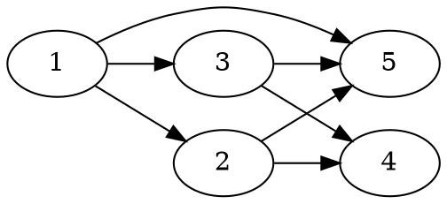

[[TOC]]

### 题意

这题给了一张没有环的有向图。

- 前 `m` 个点是污水接收口，每个点一开始各有 `1` 吨污水
- 每个点会把自己当前的污水平均分给所有出边
- 没有出边的点就是最终排水口

要求输出每个最终排水口最后流出的污水量，而且必须用最简分数表示。

#### 样例图

这张图展示样例中的排水关系：

`1` 号点先把 `1` 吨水均分成三份，分别流向 `2,3,5`。
其中流到 `2` 和 `3` 的水还会继续被均分一次，所以最后 `4` 收到 `1/3`，`5` 收到 `2/3`。
因为题目要求精确输出，所以这里不能用浮点数近似，必须直接维护分数。

### 思路

先看一个最直接的小数据暴力：

@include-code(./brute.cpp, cpp)

这个暴力完全按题意递归分流：

- 当前来到点 `u`，手里有 `cur` 吨污水
- 如果 `u` 是汇点，就把 `cur` 加到答案里
- 否则把 `cur` 平均分成 `outdeg[u]` 份，递归流向每个后继

这个写法很直观，但如果图很大、路径很多，就会重复遍历很多公共后缀。

题目已经保证整张图是 DAG，所以更高效的办法是按拓扑序传播流量。

做法如下：

1. 用分数 `num / den` 精确保存每个点当前累计到的污水量。
2. 前 `m` 个接收口初始都设成 `1/1`。
3. 求整张图的拓扑序。
4. 按拓扑序处理每个点 `u`：
   - 如果 `u` 不是汇点，就把 `water[u]` 均分成 `outdeg[u]` 份
   - 每个后继 `v` 都加上这一份
5. 最后所有出度为 `0` 的点就是答案。

这里用到的关键实现是一个简单分数类：

- 加法时通分再约分
- 除以整数时直接把分母乘上这个整数

代码结构上和你算法书里的拓扑模板保持一致：先建图和统计入度，再用队列按拓扑序顺推。

### 代码

@include-code(./main.cpp, cpp)

### 复杂度

设点数为 `n`，边数为 `E`。

- 拓扑排序扫描每个点、每条边各一次，复杂度 `O(n + E)`
- 每次分数运算都只做常数次 `gcd`

总时间复杂度 `O(n + E)`，空间复杂度 `O(n + E)`。

### 总结

这题本质是 DAG 上的流量传播。识别出“无环 + 每条边均分”以后，直接按拓扑序把分数往后推即可。真正容易错的点只有一个：一定要用精确分数，不能用 `double`。
