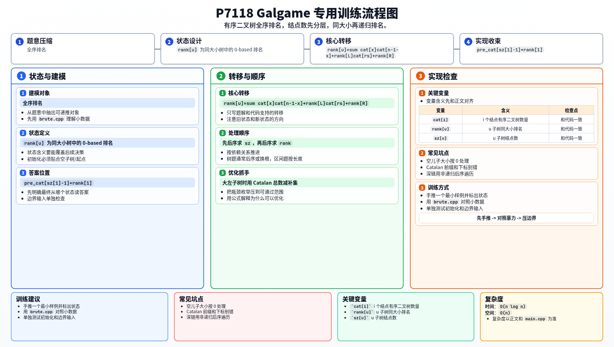

[[TOC]]

### 题意

把一款 Galgame 看成一棵有序二叉树：

- 每个结点是一个场景
- 左儿子表示选 A 后到达的场景
- 右儿子表示选 B 后到达的场景
- `0` 表示空场景

题目定义了两棵树谁更有趣：

1. 先比较可达场景总数
2. 场景总数相同就比较左子树
3. 左子树也相同再比较右子树

要求输出当前这棵树前面有多少个本质不同、并且更不有趣的 Galgame，答案对 `998244353` 取模。

### 思路

先看一个可以直接验证想法的朴素解：

@include-code(./brute.cpp, cpp)

这个暴力会把所有本质不同的小规模有序二叉树全部生成出来，再按题目规则给它们编号。

所以这题本质上就是求：

- 当前这棵有序二叉树
- 在所有本质不同有序二叉树组成的全序里
- 排名是多少

#### 关键拆分

答案可以拆成两部分：

1. 结点数更小的所有树数量
2. 与当前树结点数相同，但更不有趣的树数量

第一部分很好办，因为有序二叉树的本质不同结构数正是 Catalan 数。

设：

- `cat[i]` 表示 `i` 个结点的本质不同有序二叉树数量

那么第一部分就是：

`cat[1] + cat[2] + ... + cat[sz[root]-1]`

#### 同大小内部排名

设当前结点 `u`：

- 左子树大小是 `ls`
- 右子树大小是 `rs`

定义：

- `rank[u]`：`u` 这棵树在所有大小为 `sz[u]` 的树中的排名，从 `0` 开始

则同大小下所有更不有趣的树分成三段：

| 部分 | 数量 |
| --- | --- |
| 左子树大小更小 | `sum cat[x] * cat[sz[u]-1-x]` |
| 左子树大小相同，但左子树排名更小 | `rank[left] * cat[rs]` |
| 左子树完全相同，右子树排名更小 | `rank[right]` |

所以：

`rank[u] = sum_{x=0}^{ls-1} cat[x] * cat[sz[u]-1-x] + rank[left] * cat[rs] + rank[right]`

#### 递推公式与排名公式

对每个结点 `u`，需要维护两个量：

$$
sz[u] = sz[lc[u]] + sz[rc[u]] + 1
$$

$$
rank[u] =
\sum_{x=0}^{ls-1} cat[x] \cdot cat[sz[u]-1-x]
+ rank[lc[u]] \cdot cat[rs]
+ rank[rc[u]]
$$

最终答案是：

$$
pre\_cat[sz[1]-1] + rank[1]
$$

第一项如果直接枚举，在极端结构下会很慢。

这里继续利用 Catalan 总和：

`cat[sz[u]] = sum_{x=0}^{sz[u]-1} cat[x] * cat[sz[u]-1-x]`

如果左子树比较大，就改成“总数减补集”，于是每个结点只需要枚举左右子树里较小的一边。

最后答案就是：

`pre_cat[sz[root]-1] + rank[root]`

其中 `pre_cat[i]` 是 `cat` 的前缀和。

### 代码

@include-code(./main.cpp, cpp)

### 复杂度

- 预处理 Catalan 数 `O(n)`
- 两次 DFS `O(n)`
- 排名计算部分整体 `O(n log n)`
- 额外使用若干长度为 `n` 的数组
- 总空间复杂度 `O(n)`

### 总结

这题最关键的是把原题的“有趣度比较”翻译成一棵有序二叉树的全序排名问题。

一旦看出这一点，后面就只是在做：

- Catalan 数计数
- 同大小树的递归字典序排名

### 一图流解析

这张图把本题的建模、关键转移、实现检查和训练方法压缩到一页，适合读完正文后复盘。

