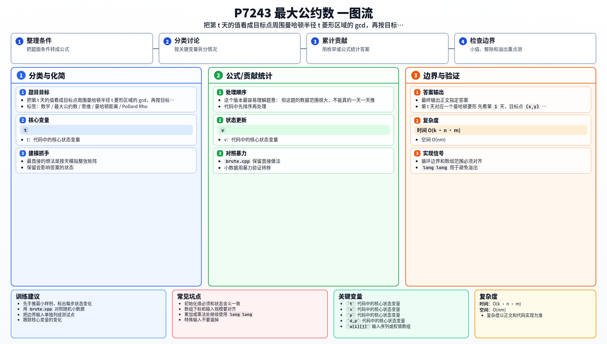

[[TOC]]

### 题意

有一个 `n × m` 的矩阵。

一次变换会把每个位置 `(i,j)` 改成：

- 自己；
- 上下左右存在的格子；

这些数的最大公约数。

现在只问一个位置 `(x,y)`：它最少经过多少次变换会变成 `1`。

如果无论怎么变都不可能变成 `1`，输出 `-1`。

### 思路

最直接的想法是按天模拟整张矩阵。

这个版本最容易理解题意：

@include-code(./brute.cpp, cpp)

但这题的数据范围很大，不能真的一天一天推。

#### 第 t 天对应一个曼哈顿菱形

先看第 `1` 天，目标点 `(x,y)` 取的是：

- 自己；
- 上下左右。

这正是一个曼哈顿距离不超过 `1` 的区域。

再看第 `2` 天，它取的是这几个点第 `1` 天结果的 gcd。由于 gcd 具有结合律和交换律，所以最终等价于把更大一圈的初始格子全部一起取 gcd。

继续归纳下去，可以得到：

第 `t` 天时，`(x,y)` 的值等于所有满足

`|i-x| + |j-y| <= t`

的初始格子的整体 gcd。

#### 只需要关心目标值的质因子

设目标点初始值是 `v = a[x][y]`。

以后每一天的值都只会不断变小，所以它的质因子只会消失，不可能新出现。

因此我们只需要关心 `v` 的不同质因子。

设其中一个质因子是 `p`。

如果半径 `t` 的菱形里所有数都还能被 `p` 整除，那么第 `t` 天后的 gcd 里还会保留 `p`。

反过来，只要这个菱形里出现了一个不能被 `p` 整除的格子，那么 `p` 就被消掉了。

所以对于每个质因子 `p`，只要求出：

离 `(x,y)` 最近的、满足 `a[i][j] % p != 0` 的格子的曼哈顿距离 `d_p`。

那么：

- 当 `t < d_p` 时，`p` 还在；
- 当 `t >= d_p` 时，`p` 已经消失。

最终值要变成 `1`，就要求所有质因子都消失。

所以答案就是：

所有 `d_p` 的最大值。

如果某个质因子在整张矩阵里都找不到“不能整除它”的格子，那么它永远不会消失，答案就是 `-1`。

#### 为什么要用 Pollard Rho

因为 `a[i][j]` 最大可达 `10^18`，而我们只需要分解目标点 `a[x][y]` 的质因子。

这个范围下，用 `Miller Rabin + Pollard Rho` 提取不同质因子是比较稳妥的做法。

### 代码

@include-code(./main.cpp, cpp)

### 复杂度

- 时间复杂度：`O(k · n · m)`
- 空间复杂度：`O(nm)`

其中 `k` 是目标点初始值的不同质因子个数，实际非常小。

### 总结

这题最关键的不是 gcd 本身，而是把局部更新看成“曼哈顿半径不断扩大的菱形区域 gcd”。

一旦把这个传播范围看清楚，问题就从“动态模拟”变成了“每个质因子最早什么时候会被周围某个格子消掉”。

### 一图流解析

这张图把本题的建模、关键转移、实现检查和训练方法压缩到一页，适合读完正文后复盘。

