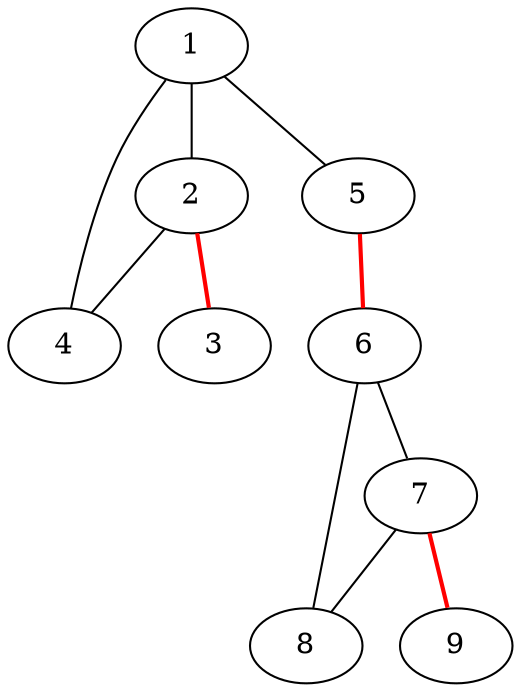
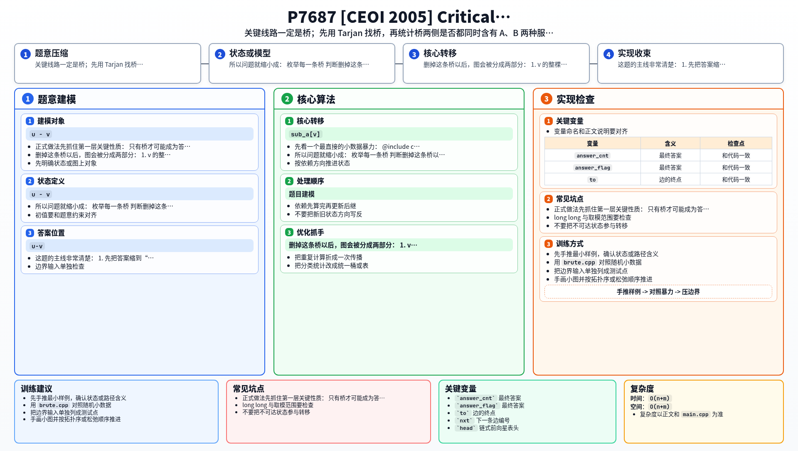

[[TOC]]

### 题意

给一张连通无向图。

有些点提供 `A` 服务，有些点提供 `B` 服务，一个点可以同时提供两种服务。

如果删掉某条边以后，出现下面情况：

- 存在某个点，无法到达任意一个 `A` 服务点
- 或者无法到达任意一个 `B` 服务点

那么这条边就叫关键通信线路。

要求输出：

1. 关键通信线路的数量
2. 每条关键通信线路对应的两个端点

原题有 Special Judge，所以答案边的输出顺序、以及同一条边两个端点的先后顺序，都不唯一。
本仓库为了让 `check_sample.py` 做精确比对，固定采用“按输入边方向输出”的一种合法格式。

#### 样例图

这张图展示样例中的主干结构：

红色边都是桥，但并不是所有桥都一定是答案。
真正关键的是：删掉它之后，某一侧会不会缺少 `A` 或 `B` 服务。

### 思路

先看一个最直接的小数据暴力：

@include-code(./brute.cpp, cpp)

暴力做法完全按题意来：

1. 枚举删掉哪一条边
2. 重新求删边后的连通块
3. 看是否存在某个连通块没有 `A` 服务，或者没有 `B` 服务

这个思路很好理解，但每删一条边都要重跑一遍 DFS，复杂度太高。

正式做法先抓住第一层关键性质：

- 只有桥才可能成为答案

因为如果一条边不是桥，删掉它以后图仍然连通，所有点还能访问原来的所有服务，自然不可能出问题。

所以问题就缩小成：

- 枚举每一条桥
- 判断删掉这条桥以后，两侧是否都同时含有 `A` 和 `B`

设 DFS 树上一条桥是 `u - v`，其中 `v` 是 `u` 的儿子。
删掉这条桥以后，图会被分成两部分：

1. `v` 的整棵 DFS 子树
2. 其余所有点

这时只要维护：

- `sub_a[v]`：`v` 子树里有多少个 `A` 服务点
- `sub_b[v]`：`v` 子树里有多少个 `B` 服务点

另一侧的数量就是：

- `total_a - sub_a[v]`
- `total_b - sub_b[v]`

于是桥 `u-v` 是关键线路，当且仅当下面四个数里有一个为 `0`：

- `sub_a[v]`
- `sub_b[v]`
- `total_a - sub_a[v]`
- `total_b - sub_b[v]`

也就是删桥后的某一侧缺少了至少一种服务。

实现上，我把“找桥”和“统计子树服务数量”合在同一遍 DFS 里做完。
因为这题不需要根节点特判，所以写法比割点、点双还更直接。

### 代码

@include-code(./main.cpp, cpp)

### 复杂度

每个点访问一次，每条边只会被常数次处理，所以：

- 时间复杂度 `O(n+m)`
- 空间复杂度 `O(n+m)`

### 总结

这题的主线非常清楚：

1. 先把答案缩到“只有桥才可能出事”
2. 再把“删桥后会不会缺服务”翻译成桥两侧的 `A/B` 数量判断

因此它本质上就是：

- `Tarjan 求桥`
- `DFS 子树计数`

一旦把这两件事接起来，判定条件就只剩下四个数量里是否出现 `0`。

### 一图流解析

这张图把本题的建模、关键转移、实现检查和训练方法压缩到一页，适合读完正文后复盘。

