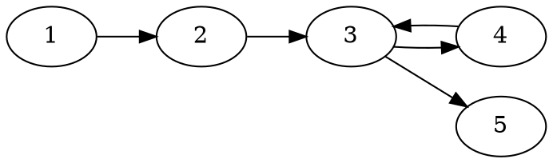

[[TOC]]

### 题意

给一张有向图，要求输出一条**字典序最小**的欧拉路径。

也就是：

- 每条边恰好走一次
- 输出经过的顶点序列
- 如果不存在这样的路径，输出 `No`

#### 样例图

这张图展示样例 2 的结构：

从 `3` 出发时，既可以去 `4`，也可以去 `5`。
为了让最终顶点序列字典序最小，应该优先走向编号更小的 `4`，于是答案是 `1 2 3 4 3 5`。
这说明除了判定欧拉路存在，还要额外处理“出边按什么顺序走”。

### 思路

先看一个小数据暴力：

@include-code(./brute.cpp, cpp)

暴力直接枚举所有可能的走法：

- 从每个点尝试作为起点
- 每次任选一条还没用过的出边继续走
- 如果最后恰好用完全部边，就得到一条候选欧拉路径
- 在这些候选里取字典序最小

这个办法只能验证小数据，正式做法要用 Hierholzer。

先回顾有向欧拉路的存在条件：

1. 把有向边看成无向边后，所有有边的点要连通
2. 度数满足以下两种之一：
   - 所有点 `in = out`，存在欧拉回路
   - 恰有一个点满足 `out = in + 1`，作为起点
   - 恰有一个点满足 `in = out + 1`，作为终点

有了解的判定后，再考虑字典序。

Hierholzer 的特点是：

- 走边时先不输出
- 回溯时再把点放进答案
- 所以答案会**倒着产生**

为了让最终答案字典序最小，只要让每个点总是优先走向编号更小的后继即可。

实现上：

1. 每个点的出边按终点升序排序
2. 用栈模拟 Hierholzer
3. 当前点还有边，就沿最小的那条边继续走
4. 当前点没边了，就把它放进 `path`
5. 最后把 `path` 倒着输出

### 代码

@include-code(./main.cpp, cpp)

### 复杂度

设点数为 `n`，边数为 `m`。

- 判连通和度数检查是 `O(n + m)`
- 邻接表排序总复杂度 `O(m \log m)` 量级
- Hierholzer 主过程是 `O(n + m)`

总时间复杂度 `O(m \log m)`，空间复杂度 `O(n + m)`。

### 总结

这题就是“有向欧拉路 + 字典序”模板。难点不在 Hierholzer 本身，而在两件事：

- 先把欧拉路存在条件判对
- 再利用“答案逆序产生”这个性质，把出边顺序处理成最终的最小字典序
