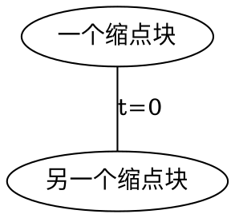
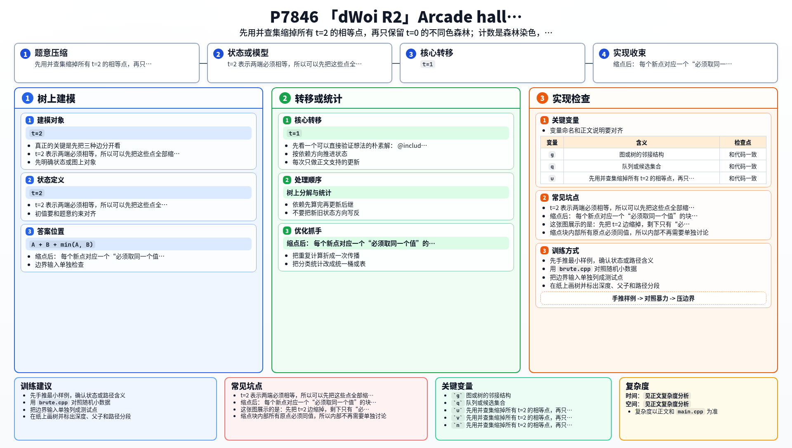

[[TOC]]

### 题意

给一棵树，每条边有三种关系：

- `0`：两端点权必须不同
- `1`：没有要求
- `2`：两端点权必须相同

每个点权 `w_i` 都在 `[1,R]` 内。

要求输出：

- 合法序列数量（对 `1e9+7` 取模）
- 所有合法序列里 `sum(w_i)` 的最小值；若无解输出 `0`

### 思路

先看一个可以直接验证想法的朴素解：

@include-code(./brute.cpp, cpp)

`brute.cpp` 直接枚举所有点权，再检查每条边的约束。
这个做法完全正确，但复杂度是 `R^n`，只能处理很小的数据。

真正的关键是先把三种边分开看。

`t=2` 表示两端必须相等，所以可以先把这些点全部缩成一个并查集块。

缩点后：

- 每个新点对应一个“必须取同一个值”的块
- 这个块的权重就是它包含多少个原点

再看剩余边：

- `t=1` 没有限制，可以直接忽略
- `t=0` 只要求两个块取值不同

这样问题就被化成了一片森林上的约束。

#### 缩点后的理解

这张图展示的是：先把 `t=2` 边缩掉，剩下只有“必须不同”的边真正有约束。

缩点块内部所有原点必须同值，所以内部不再需要单独讨论。
剩下的 `t=0` 边只是在这些块之间做“不同色”限制。

第一问就变成森林 proper coloring 计数。

对于一个 `t=0` 连通块：

- 第一个点有 `R` 种选法
- 之后每条边往下扩展时都有 `R-1` 种

所以若这个连通块有 `s` 个缩点，方案数就是：

`R * (R-1)^(s-1)`

所有连通块相乘即可。

第二问则更简单。

因为森林一定是二分图，所以想让总和最小，只需要使用最小的两种值 `1` 和 `2`。
设某个连通块二分染色后两侧原点数总和分别是 `A,B`，那么：

- 一侧放 `1`
- 另一侧放 `2`

最优代价就是：

`A + B + min(A, B)`

也就是让较大的那一侧用 `1`，较小的一侧用 `2`。

对于没有任何 `t=0` 约束的孤立块，直接全部取 `1` 即可。

### 代码

@include-code(./main.cpp, cpp)

### 复杂度

并查集、建图、染色都只需要线性级别处理。

总时间复杂度是 `O(n alpha(n))`，空间复杂度是 `O(n)`。

### 总结

这题最核心的拆分是：

- `t=2` 先缩点
- `t=1` 直接忽略
- `t=0` 变成森林上的不同色约束

这样第一问变成森林染色计数，第二问变成带点权二分染色最小代价。

### 一图流解析

这张图把本题的建模、关键转移、实现检查和训练方法压缩到一页，适合读完正文后复盘。

