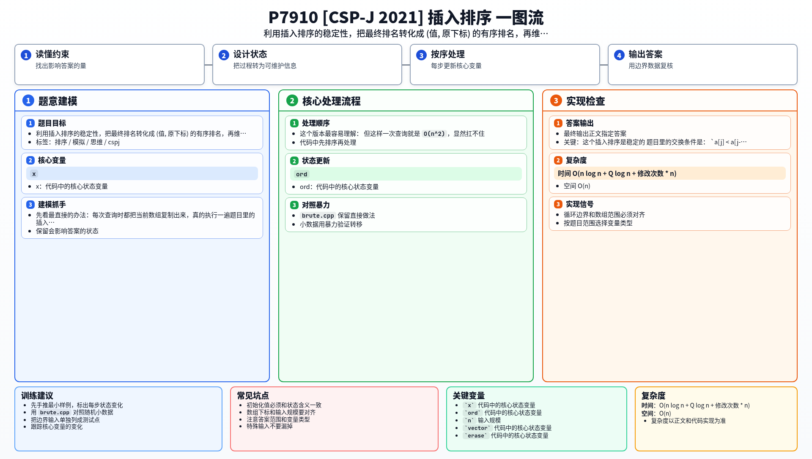

[[TOC]]

### 题意

给一个数组，要支持两种操作：

1. 修改 `a[x] = v`；
2. 假设现在对整个数组执行题目给出的插入排序，询问“原下标为 `x` 的这个元素”最终会排在第几位。

注意这里问的是“元素的位置”，不是“值的位置”。

如果有多个相同的值，它们仍然要按照原下标区分。

### 思路

先看最直接的办法：每次查询时都把当前数组复制出来，真的执行一遍题目里的插入排序，再去找原下标 `x` 的元素最后在哪里。

这个版本最容易理解：

@include-code(./brute.cpp, cpp)

但这样一次查询就是 `O(n^2)`，显然扛不住。

#### 关键：这个插入排序是稳定的

题目里的交换条件是：

`a[j] < a[j-1]`

只有严格小于才交换，所以当两个数相等时，它们不会互换位置。

这就说明：相等元素的相对顺序不会变，也就是这个排序是稳定排序。

那么最终结果就不必再从“插入排序过程”去看，而可以直接改写成：

把每个元素看成二元组 `(a[i], i)`，然后按这个二元组升序排序。

原因很直接：

- 值小的元素一定在前面；
- 值相同的元素，因为稳定性，原下标小的仍然在前面。

所以查询 `2 x` 的答案，其实就是 `(a[x], x)` 在所有二元组里的排名。

#### 用一个有序表维护所有二元组

维护一个升序数组 `ord`，里面存当前所有 `(a[i], i)`。

这样：

- 查询 `2 x`：直接二分查找 `(a[x], x)` 在 `ord` 中的位置；
- 修改 `1 x v`：先删掉旧的 `(a[x], x)`，再插入新的 `(v, x)`。

#### 为什么可以直接用 vector

通常动态有序表会想到平衡树，但这题其实不需要。

因为：

- `n` 只有 `8000`；
- 修改次数最多只有 `5000`。

所以即使每次修改都在 `vector` 里做一次 `erase` 和 `insert`，单次 `O(n)`，总搬移量也完全能接受。

查询很多时，二分 `O(log n)` 也足够快。

### 代码

@include-code(./main.cpp, cpp)

### 复杂度

- 时间复杂度：`O(n log n + Q log n + 修改次数 * n)`
- 空间复杂度：`O(n)`

### 总结

这题真正要抓住的是“插入排序这里是稳定排序”。

一旦把这一点想清楚，问题就从“模拟排序过程”变成了“维护 `(值, 下标)` 的动态有序排名”，写法会直接简化很多。

### 一图流解析

这张图把本题的建模、关键转移、实现检查和训练方法压缩到一页，适合读完正文后复盘。

