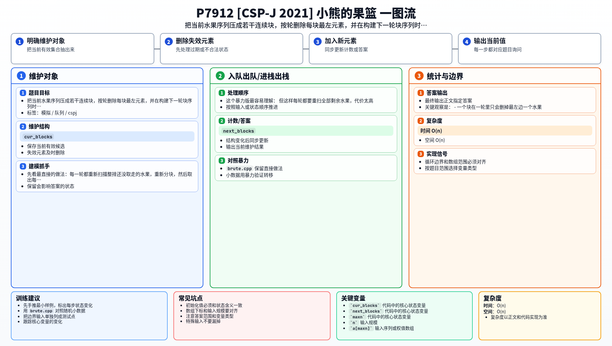

[[TOC]]

### 题意

一排水果由 `0/1` 组成，连续相同的水果叫作一个“块”。

每一轮都要从当前每个块中取出最左边的那个水果，按从左到右顺序装成一个果篮。

重复这个过程直到所有水果都被取完，要求输出每一轮果篮里的水果编号。

### 思路

先看最直接的做法：每一轮都重新扫描整排还没取走的水果，重新分块，然后取出每个块最左边的水果。

这个暴力版最容易理解：

@include-code(./brute.cpp, cpp)

但这样每轮都要重扫全部剩余水果，代价太高。

关键观察是：

- 一个块在一轮里只会删掉最左边一个水果；
- 块内部剩余部分还是连续的；
- 真正会变化的是块与块之间的关系，尤其是相邻同类块可能在下一轮合并。

所以没必要每轮重建整排水果，只要维护“当前有哪些块”即可。

做法是：

1. 先把原序列压成若干初始块；
2. 用 `cur_blocks` 表示当前轮的块顺序；
3. 依次处理每个块：
   - 输出它当前块头的编号；
   - 把块头向后移一格；
   - 如果块还有剩余，就把它放进 `next_blocks`；
   - 如果 `next_blocks` 最后一个块和它同类，就直接合并。
4. 一轮结束后让 `cur_blocks = next_blocks`，进入下一轮。

### 代码

@include-code(./main.cpp, cpp)

### 复杂度

- 时间复杂度：`O(n)`
- 空间复杂度：`O(n)`

### 总结

这题的核心不是复杂算法，而是换一个维护对象：

- 不去维护“当前整排水果”
- 而是维护“当前块的顺序”

这样每个水果只会被处理一次，整个过程就能线性完成。

### 一图流解析

这张图把本题的建模、关键转移、实现检查和训练方法压缩到一页，适合读完正文后复盘。

