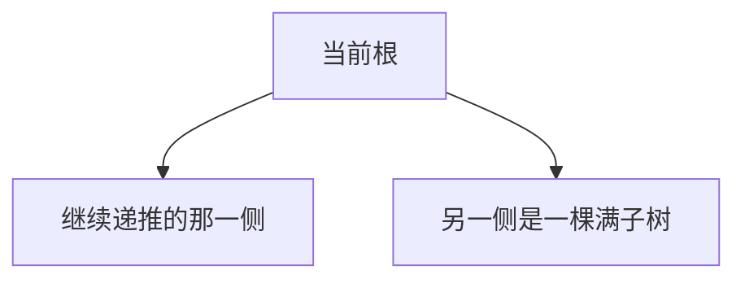

[[TOC]]

### 题意

给一棵 `dep` 层的完全二叉树。

要求统计有多少个“包含根节点的连通块”，答案对 `998244353` 取模。

### 思路

先看一个适合小数据验证的暴力：

@include-code(./brute.cpp, cpp)

如果树真的建出来，那么设 `f(u)` 表示“在 `u` 子树中，选出的连通块必须包含 `u` 的方案数”，就有：

`f(u) = (f(ls)+1)(f(rs)+1)`

因为左右子树都可以：

- 一个点不选
- 或者选一个包含对应儿子根节点的连通块

难点不在转移，而在树太大，不能显式建出来。

这题的关键观察是：

- 完全二叉树除了最后一层外，其余层都是满的
- 所以整棵树只有“最后一个叶子到根”的那条路径附近是不规则的
- 路径旁边挂着的子树，不是满树就是空树

于是先预处理：

- `A[h] = 高度为 h 的满二叉树方案数 + 1`

满足：

- `A[0] = 1`
- `A[h] = A[h-1]^2 + 1`

然后把“最后一层节点个数”减一，得到最后一个叶子在底层的 `0-based` 编号。
它的二进制表示，正好告诉我们从根到这个叶子的路径每一层是往左走还是往右走。

下面这张图展示了这种结构：

所以可以自底向上回推：

- 一边继续带着当前 `val`
- 另一边直接乘预处理好的满树方案数

整题就从“指数级建树”变成了“扫一遍二进制路径”。

### 代码

@include-code(./main.cpp, cpp)

### 复杂度

预处理 `O(max dep)`，每组询问 `O(dep)`，总空间复杂度 `O(max dep)`。

### 总结

这题最值得记住的点是：

- 完全二叉树的不完整部分，可以压缩成一条路径
- 路径旁边的大块结构，都能用“满树递推值”一次处理掉

这是处理超大规模完全二叉树计数题时很常见的一类技巧。
