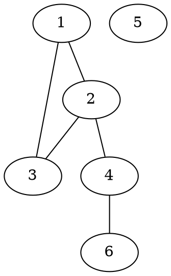
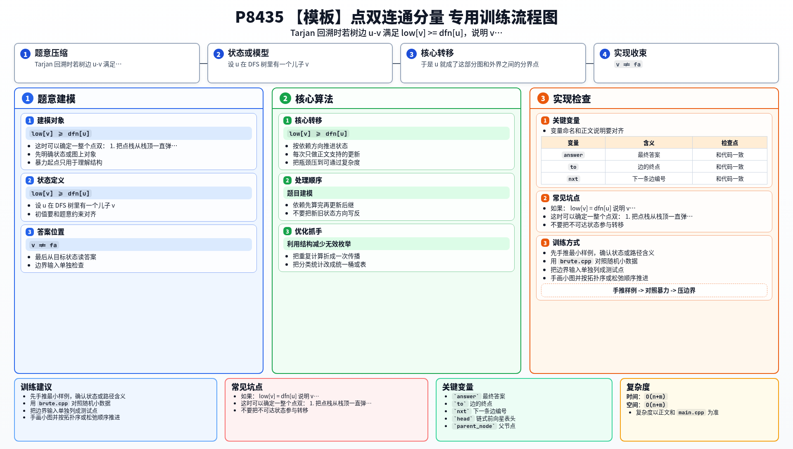

[[TOC]]

### 题意

给一张允许有重边、自环，而且可能不连通的无向图。

要求输出：

1. 点双连通分量的个数
2. 每个点双连通分量里有哪些点

这题采用的定义是：

- 一个极大的“没有割点”的连通子图，就是一个点双连通分量

所以这题和 `P3388` 的关系非常直接：

- 割点会把图切成多个点双
- 同一个割点可能同时属于多个点双

#### 样例图

下面用样例三说明“割点把点双切开”：

这张图里：

- `2` 是割点，因为删掉它以后，`4`、`6` 那一支会和左边断开
- `4` 也是割点，因为删掉它以后，点 `6` 会单独断开

所以图被切成四个点双：

- `{1,2,3}`
- `{2,4}`
- `{4,6}`
- `{5}`

### 思路

先看一个更直观的小数据教学版：

@include-code(./brute.cpp, cpp)

`brute.cpp` 还是 Tarjan 的判定逻辑，但它用递归来写，代码更容易看出“什么时候出栈形成一个点双”。
它适合拿来理解和对拍；正式代码之所以不能直接照搬，是因为这题数据到 `5e5` 个点，递归深度可能直接爆栈。

核心观察和你书里的点双模板一致。

设 `u` 在 DFS 树里有一个儿子 `v`。如果：

`low[v] >= dfn[u]`

说明 `v` 子树无法绕过 `u` 回到 `u` 的祖先。
于是 `u` 就成了这部分图和外界之间的分界点。

这时可以确定一整个点双：

1. 把点栈从栈顶一直弹到 `v`
2. 再把 `u` 加进来
3. 这些点共同组成一个点双连通分量

这里和强连通分量、边双有两个关键区别：

1. 点双是“在处理儿子 `v` 回溯时”形成的，不是等 `u` 整体回溯完才形成
2. `u` 可能属于多个点双，所以 `u` 不能像 SCC 那样在形成一个分量后就永久出栈

实现上还要补两个细节：

1. 图里可能有重边，不能只写 `v != fa`，必须记录进入当前点的是哪条边，只跳过它的反向边
2. 正式代码把递归 DFS 改成了显式栈模拟 DFS，这样大数据下也不会爆栈

另外，孤立点和只有自环的单点也要单独算一个点双，这正是题面特别提醒的坑点。

### 代码

@include-code(./main.cpp, cpp)

### 复杂度

每个点进出 DFS 一次，每条边只会被常数次访问，所以：

- 时间复杂度 `O(n+m)`
- 空间复杂度 `O(n+m)`

### 总结

这题的主线可以直接记成一句话：

- 割点把点双切开，`low[v] >= dfn[u]` 时，`u` 和 `v` 子树的一段点会形成一个新的点双

真正实现时要特别留意三件事：

1. 割点可以属于多个点双，所以 `u` 不能被永久弹栈
2. 重边要用边编号过滤父边
3. 大数据下递归会爆栈，正式代码最好改成非递归

### 一图流解析

这张图把本题的建模、关键转移、实现检查和训练方法压缩到一页，适合读完正文后复盘。

