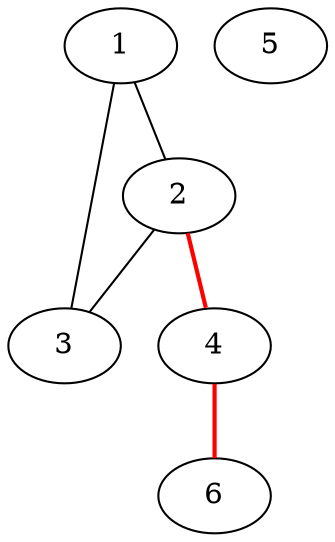
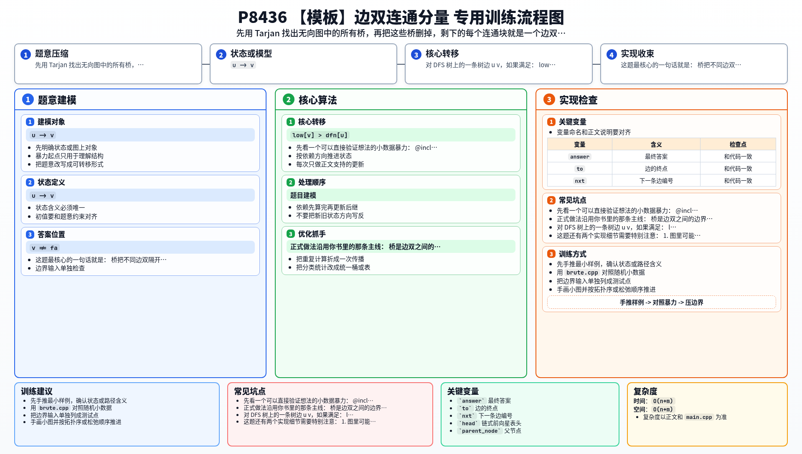

[[TOC]]

### 题意

给一张允许有重边、自环，而且可能不连通的无向图。

要求输出：

1. 边双连通分量的个数
2. 每个边双连通分量里有哪些点

这里的边双连通分量可以理解成：

- 在这个点集内部，任意两点之间至少有两条边不重复的路径
- 或者等价地说，这个点集内部没有桥作为唯一通道

#### 样例图

下面这张图用样例三来说明“桥把边双隔开”这件事：

图中红色边 `2-4` 和 `4-6` 都是桥。
把它们删掉以后，图就被分成了四块：

- `{1,2,3}`
- `{4}`
- `{5}`
- `{6}`

这四个连通块，正好就是这个样例的边双连通分量。

### 思路

先看一个可以直接验证想法的小数据暴力：

@include-code(./brute.cpp, cpp)

暴力做法分两步：

1. 枚举每一条边，删掉它后重新数连通块个数
2. 如果连通块数量变多，说明它是桥
3. 把所有桥都删掉，再做一次 DFS，剩下的每个连通块就是一个边双

这个过程很好理解，但每条边都重新搜一遍图，复杂度太高，只适合小数据。

正式做法沿用你书里的那条主线：

- 桥是边双之间的边界
- 去掉所有桥以后，每个连通块就是一个边双

所以我们只要先用 Tarjan 找桥，再忽略桥做第二遍 DFS 即可。

对 DFS 树上的一条树边 `u -> v`，如果满足：

`low[v] > dfn[u]`

说明 `v` 这棵子树没法绕回 `u` 或 `u` 的祖先，那么边 `u-v` 就是桥。

这题还有两个实现细节需要特别注意：

1. 图里可能有重边，不能只靠 `v != fa` 来跳过父边，必须记录“进入当前点的是哪条边”，遍历时只跳过它的反向边
2. 数据范围到 `5e5` 个点、`2e6` 条边，递归 DFS 很容易爆栈，所以代码里改成了非递归 Tarjan 和非递归 DFS

最后第二遍遍历时，所有桥边都直接跳过。这样搜到的一整块点，就是同一个边双连通分量。

### 代码

@include-code(./main.cpp, cpp)

### 复杂度

设点数为 `n`，边数为 `m`。

Tarjan 找桥一遍 `O(n+m)`，删桥后再搜连通块也是一遍 `O(n+m)`，所以：

- 时间复杂度 `O(n+m)`
- 空间复杂度 `O(n+m)`

### 总结

这题最核心的一句话就是：

- 桥把不同边双隔开

因此“求边双”可以转成：

1. 先求所有桥
2. 再把桥删掉
3. 剩下每个连通块就是答案

理解了这件事，后面的边双缩点、桥树等题都会顺很多。

### 一图流解析

这张图把本题的建模、关键转移、实现检查和训练方法压缩到一页，适合读完正文后复盘。

