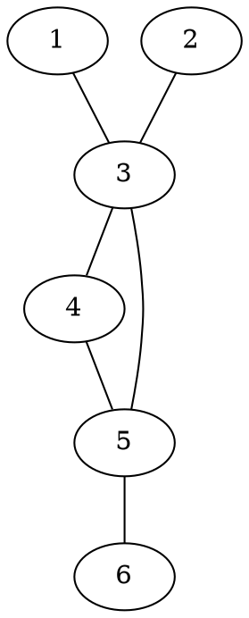
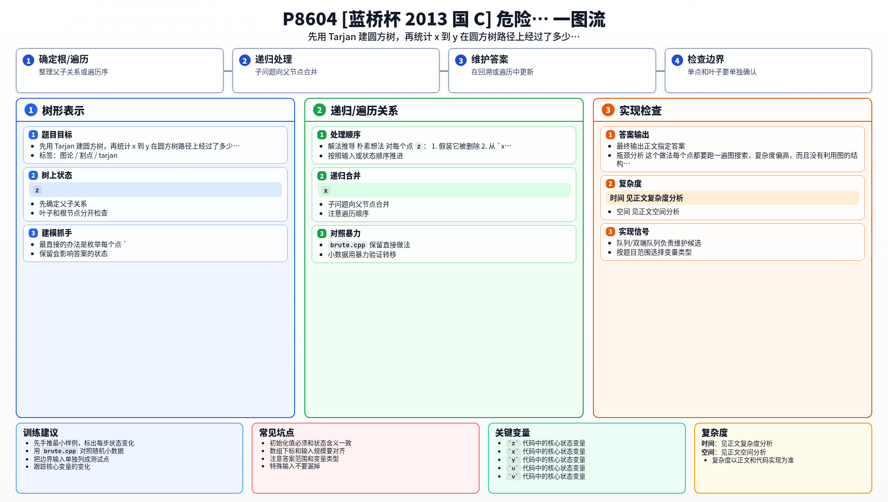

[[TOC]]

### 题意

给出一个无向图和两个点 `x, y`。

如果删掉某个点 `z` 之后，`x` 和 `y` 不再连通，那么 `z` 就是关于 `x,y` 的关键点。题目要求统计这样的关键点个数。

### 思路

最直接的办法是枚举每个点 `z`，删掉它后跑一次 BFS，看 `x` 和 `y` 是否还能连通。

先看一个可以直接验证想法的朴素解：

@include-code(./brute.cpp, cpp)

`brute.cpp` 适合小图对拍，但正式数据下没有利用图的结构。

这张图展示样例里的原图结构：

从这张图里能直观看到：`1` 到 `6` 的所有通路都必须经过 `3` 和 `5`，所以答案是 `2`。

更系统的做法是：先用 Tarjan 求点双连通分量，再建圆方树。

- 原图点保留为圆点
- 每个点双新建一个方点
- 点属于哪个点双，就在圆方树里连边

建好之后，原图中任意两点 `x, y` 的连通结构会压缩成圆方树上的唯一一条路径。路径上出现的原图圆点（排除 `x, y` 自己）恰好就是把它们分开的关键点。

所以做法就是：

1. Tarjan 建圆方树
2. 在圆方树上找 `x -> y` 路径
3. 数这条路径上经过多少个原图点

### 代码

@include-code(./main.cpp, cpp)

### 复杂度

Tarjan 和最后的 BFS 都是线性复杂度，所以总时间复杂度是 `O(n + m)`，空间复杂度也是 `O(n + m)`。

### 总结

这题的关键是把“删掉某点后是否断开”转成“圆方树路径上有哪些割点”。一旦建出圆方树，答案就变成了很直接的路径计数。

### 一图流解析

这张图把本题的建模、关键转移、实现检查和训练方法压缩到一页，适合读完正文后复盘。

