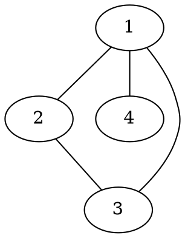

[[TOC]]

### 题意

给出一个无向图，要求统计长度恰好为 `3` 的有向转发路径数量：

`a -> b -> c -> d`

其中源点和终点可以相同，但两个中间点要和两端区分开。

### 思路

最直接的办法是暴力枚举四元组 `(a, b, c, d)`。

先看一个可以直接验证想法的朴素解：

@include-code(./brute.cpp, cpp)

`brute.cpp` 会直接检查三条边是否存在，并判断中间点是否合法，适合小图对拍。

真正的关键是固定中间那条有向边。对于一条合法路径：

`a -> b -> c -> d`

中间边唯一就是 `b -> c`。一旦这条边方向固定：

- 左端 `a` 只能从 `b` 的其他邻居里选
- 右端 `d` 只能从 `c` 的其他邻居里选

这张图展示第二个样例里的小图结构：

从这张图里可以看到，如果把 `1 -> 2` 当作中间边，那么左端只能从 `1` 的其余邻居 `{3,4}` 里选，右端只能从 `2` 的其余邻居 `{3}` 里选，所以这一条有向中间边贡献 `2 * 1 = 2` 条路径。其他边完全同理。

于是对每条无向边 `(u, v)`：

- 把它看成中间有向边 `u -> v`，贡献是 `(deg[u] - 1) * (deg[v] - 1)`
- 反过来 `v -> u` 再算一次

把所有边贡献加起来就是答案。

### 代码

@include-code(./main.cpp, cpp)

### 复杂度

只需要统计度数并遍历一次边，所以时间复杂度是 `O(n + m)`，空间复杂度也是 `O(n + m)`。

### 总结

这题的关键不在于枚举整条路径，而在于抓住“中间边唯一决定左右独立选择”这个性质。固定中间边后，问题就变成了简单的度数乘法计数。
