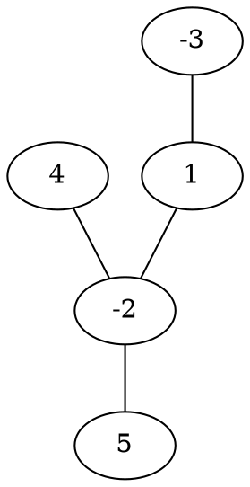

[[TOC]]

### 题意

给一棵带点权的树，可以选一个连通点集，要求点权和最大。

空集也允许，所以答案至少是 `0`。

### 思路

先看一个可以直接验证想法的朴素解：

@include-code(./brute.cpp, cpp)

`brute.cpp` 枚举所有点集，检查是否连通，再统计点权和。
这个做法完全正确，但只能处理很小的数据。

这题的关键是树形 DP。

设 `dp[u]` 表示：

- 选出的连通块必须包含 `u`
- 并且这块连通结构只能通过 `u` 再往父亲方向继续连

那么 `u` 的某个儿子子树要不要接上来，只看它的最优贡献 `dp[v]`：

- 若 `dp[v] > 0`，接上来会更优
- 若 `dp[v] <= 0`，不如不接

所以转移非常自然：

`dp[u] = val[u] + sum(max(0, dp[v]))`

其中 `v` 是 `u` 的所有儿子。

最后答案为什么是所有 `dp[u]` 的最大值？

因为任意一个非空最优连通块，都可以找到一个最靠近根的点。
把它看成这块连通结构的“顶端”，这整个连通块就一定被某个 `dp[u]` 覆盖。

再结合题目允许空集，所以最终答案应为：

`max(0, 所有 dp[u] 的最大值)`

这题样例可以用一棵小树来理解：

从这棵树中，最优连通块会选 `4-2-5-1` 这一部分，总和是：

`4 + (-2) + 5 + 1 = 8`

而点 `3` 的贡献是负数，所以不接进来更优。

### 代码

@include-code(./main.cpp, cpp)

### 复杂度

整棵树只需要一次遍历和一次倒序 DP。

时间复杂度是 `O(n)`，空间复杂度是 `O(n)`。

### 总结

这题最核心的判断只有一句话：

- 一棵子树如果能提供正贡献，就接；否则就不要

这是树上“最大连通子图和”最典型的树形 DP 思路。
