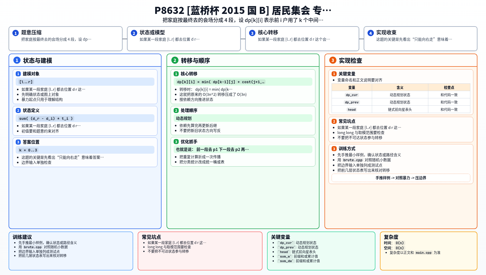

[[TOC]]

### 题意

公路上有 `n` 户家庭，第 `i` 户在位置 `d_i`，人数是 `t_i`。

要设置 4 个集会点：

- `p1, p2, p3` 在公路中间
- `p4 = L` 固定在公路终点

并满足：

`p1 <= p2 <= p3 <= p4`

每户家庭只能向右走，去参加离自己最近且不在左边的那个集会点。

某户家庭的总代价是：

`人数 * 行走距离`

要求总开销最小。

### 思路

先看一个适合小数据验证的朴素 DP：

@include-code(./brute.cpp, cpp)

因为所有家庭都只能向右走，所以一旦会场位置确定，每户家庭最终去的会场一定按顺序分成连续几段。

也就是说：

- 前一段去 `p1`
- 下一段去 `p2`
- 再下一段去 `p3`
- 最后一段去终点 `L`

所以本质上是把家庭分成 4 段。

如果某一段家庭 `[l..r]` 都去位置 `d_r` 这个会场，那么这段的总代价是：

`sum( (d_r - d_i) * t_i )`

用前缀和可以写成：

`d_r * (sum t_i) - (sum d_i * t_i)`

于是设：

`dp[k][i]` 表示前 `i` 户家庭已经用掉 `k` 个中间会场时的最小代价

这里 `k = 0..3`，终点 `L` 那个会场单独最后处理。

转移时：

`dp[k][i] = min( dp[k-1][j] + cost(j+1, i) )`

其中 `j < i`。

把 `cost(j+1, i)` 展开并整理：

`dp[k][i] = d_i * pre_w[i] - pre_dw[i] + min( dp[k-1][j] + pre_dw[j] - d_i * pre_w[j] )`

对固定的 `j` 来说，括号里的部分是一条关于 `d_i` 的直线：

`(dp[k-1][j] + pre_dw[j]) - pre_w[j] * d_i`

于是每一层 `k` 都可以做一次斜率优化。

最后，前 `i` 户用掉了 1 到 3 个中间会场后，剩下 `[i+1..n]` 这段全部去终点 `L`，把这部分代价再加上即可。

这就把原来的 `O(3n^2)` 转移压成了 `O(3n)`。

### 代码

@include-code(./main.cpp, cpp)

### 复杂度

时间复杂度 `O(n)`，空间复杂度 `O(n)`。

### 总结

这题的关键是先看出“只能向右走”意味着答案一定是按顺序分段。

一旦把问题变成“区间分段 DP”，再把区间代价整理成：

- 一个只和 `i` 有关的项
- 加上一条来自 `j` 的直线

斜率优化就很自然了。

### 一图流解析

这张图把本题的建模、关键转移、实现检查和训练方法压缩到一页，适合读完正文后复盘。

