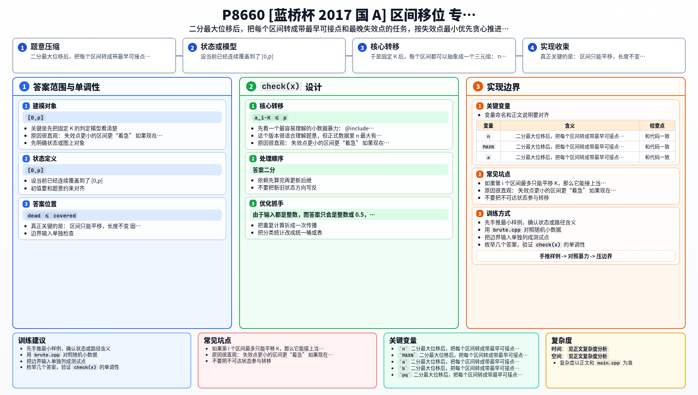

[[TOC]]

### 题意

给出 `n` 个区间 `[a_i,b_i]`。

现在可以把每个区间整体平移成 `[a_i+c_i,b_i+c_i]`，要求所有平移后的区间并起来以后，完整覆盖 `[0,10000]`。

我们要让

`max |c_i|`

尽量小，并输出这个最小值。

### 思路

先看一个最容易理解的小数据暴力：

@include-code(./brute.cpp, cpp)

`brute.cpp` 固定一个答案 `K` 以后，直接 DFS 枚举“下一个使用哪个区间”，求最远能把覆盖前缀推进到哪里。

这个版本很适合理解题意，但正式数据里 `n` 最大有 `10000`，显然不能这样枚举。

关键是先把固定 `K` 的判定模型看清楚。

设当前已经连续覆盖到了 `[0,p]`。
如果第 `i` 个区间最多只能平移 `K`，那么它能接上当前前缀，当且仅当：

- `a_i-K <= p`
- `p < b_i+K`

一旦接上，它最多只能把前缀推进到：

`min(p + (b_i-a_i), b_i+K)`

注意这里不是直接把区间当成 `[a_i-K,b_i+K]` 去做普通并集覆盖，因为区间长度不能变，它只是整体平移。

于是固定 `K` 后，每个区间都可以抽象成一个三元组：

- `need_left = a_i-K`
- `dead = b_i+K`
- `len = b_i-a_i`

含义是：

- 当前前缀至少到 `need_left`，这个区间才可用
- 当前前缀一旦达到 `dead`，这个区间就彻底失效
- 使用它以后，前缀最多增加 `len`

接下来问题就变成：

> 当前前缀从 `0` 开始，反复选择一个“已经可用且还没失效”的区间，让前缀尽量推进到 `10000`。

这里正确的贪心是：

> 每一步都优先使用当前失效点 `dead` 最小的区间。

原因很直观：

- 失效点更小的区间更“着急”
- 如果现在不用它，前缀继续往右走，它只会更容易彻底失效
- 失效点更大的区间相对更能等待

实现时：

1. 把所有区间按 `need_left` 从小到大排序
2. 用小根堆维护当前已经可用的区间
3. 堆关键字取 `dead`
4. 每次先把 `need_left <= covered` 的区间加入堆
5. 再把 `dead <= covered` 的失效区间弹掉
6. 取堆顶区间，把 `covered` 更新为 `min(covered + len, dead)`

如果最终 `covered >= 10000`，说明这个 `K` 可行。

由于输入都是整数，而答案只会是整数或 `0.5`，所以把所有坐标统一乘 `2` 后，就可以完全用整数二分，不需要处理浮点误差。

### 代码

@include-code(./main.cpp, cpp)

### 复杂度

设 `check(K)` 的一次判定中：

- 排序复杂度是 `O(n log n)`
- 每个区间最多入堆、出堆一次，总堆操作也是 `O(n log n)`

所以一次判定是 `O(n log n)`。

二分答案的范围是乘 `2` 后的 `[0,20000]`，因此总复杂度为：

`O(n log n log V)`

其中 `V = 20000`。

空间复杂度是 `O(n)`。

### 总结

这题最容易走偏的地方，是把区间错误地当成 `[a_i-K,b_i+K]` 的普通扩张区间。

真正关键的是：

- 区间只能平移，长度不变
- 固定 `K` 后，每个区间本质上是一个“有最早可接点、最晚失效点、固定推进长度”的任务
- 判定时按最早失效优先，用堆贪心推进前缀

把这个模型想清楚以后，整题就是一个标准的“二分答案 + 贪心判定”。

### 一图流解析

这张图把本题的建模、关键转移、实现检查和训练方法压缩到一页，适合读完正文后复盘。

