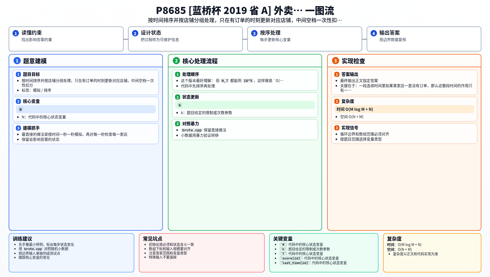

[[TOC]]

### 题意

有 `N` 家外卖店，初始优先级都为 `0`。

每过一个时刻：

- 如果某店这一时刻没有订单，优先级减 `1`，最低到 `0`；
- 如果这一时刻有 `k` 单，优先级加 `2k`。

同时系统维护一个“优先缓存”：

- 优先级 `> 5` 时加入缓存；
- 优先级 `<= 3` 时移出缓存。

给出 `T` 时刻以内的所有订单，问 `T` 时刻时缓存中有多少家店。

### 思路

最直接的做法是按时间一秒一秒模拟，再对每一秒检查每一家店。

这个版本最好理解：

@include-code(./brute.cpp, cpp)

但 `N,T` 都能到 `10^5`，这样做是 `O(NT)`，肯定过不去。

关键在于：一段连续时间里如果某家店一直没有订单，那么这整段时间的作用只有一件事，就是优先级不断减 `1`，直到降到 `0`。

所以我们没必要把这段空白时间逐秒展开，可以一次性处理。

#### 只在“有订单的时刻”更新

把所有订单按 `(时间, 店铺编号)` 排序。

然后维护三样东西：

- `score[id]`：这家店当前优先级；
- `last_time[id]`：这家店上一次被处理到的时刻；
- `in_cache[id]`：这家店当前是否在优先缓存里。

现在处理某家店在时刻 `t` 的一组订单，假设这一组一共有 `cnt` 单。

先看它从上一次处理到现在，中间空了多久：

`gap = t - last_time[id] - 1`

这 `gap` 个时刻都没有订单，所以可以一次性扣掉：

`score[id] = max(0, score[id] - gap)`

如果扣完后 `score[id] <= 3`，说明它已经不在优先缓存里了。

然后再把这一时刻的订单一起加上：

`score[id] += 2 * cnt`

如果新分数 `> 5`，就加入缓存。

#### 别忘了补到 T 时刻

所有订单处理完之后，每家店还要再把“最后一次出现之后到 `T`”这一段空白时间补扣掉。

补完之后，再根据是否 `<= 3` 决定它会不会被移出缓存。

### 代码

@include-code(./main.cpp, cpp)

### 复杂度

- 时间复杂度：`O(M log M + N)`
- 空间复杂度：`O(N + M)`

### 总结

这题的本质是“带时间轴的模拟”，关键不是状态多难，而是要识别出：

连续很多个“没订单的时刻”可以整体压缩成一次扣分。

因此做法就是：

1. 按时间排序订单；
2. 只在真正有订单的时刻更新对应店铺；
3. 最后补上每家店到 `T` 的尾巴。

### 一图流解析

这张图把本题的建模、关键转移、实现检查和训练方法压缩到一页，适合读完正文后复盘。

