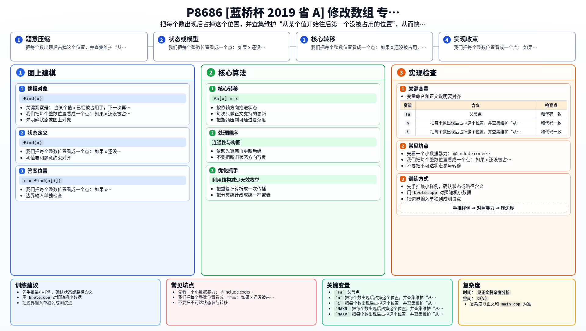

[[TOC]]

### 题意

给定一个数组，从左到右依次处理每个数。

处理到 `a[i]` 时：

- 如果它之前没出现过，就保留
- 如果它之前出现过，就不断加 `1`
- 直到变成一个之前没有出现过的数为止

问最后整个数组会变成什么。

### 思路

先看一个小数据暴力：

@include-code(./brute.cpp, cpp)

暴力很直接：

- 用一个集合记录已经出现过的值
- 处理当前数时，只要它已经出现过，就不停 `+1`

这个思路容易理解，但如果重复很多次，可能会连续试很多个位置。

关键观察是：

- 当某个值 `x` 已经被占用了，下一次再想放到 `x`，我们真正关心的是“从 `x` 开始往后，第一个没被占用的位置在哪里”

这正是一个“后继并查集”模型。

我们把每个整数位置看成一个点：

- 如果 `x` 还没被占用，那么 `find(x) = x`
- 如果 `x` 已经被占用，就把它并到 `x+1`
- 这样 `find(x)` 就会一路跳到后面第一个可用位置

处理流程：

1. 初始化 `fa[x] = x`
2. 处理当前值 `a[i]` 时，令 `x = find(a[i])`
3. 把答案位置设成 `x`
4. 表示 `x` 已经被占用，于是令 `fa[x] = find(x + 1)`

这样每个位置一旦被占用，就会自动跳到下一个可用位置，避免反复试探。

### 代码

@include-code(./main.cpp, cpp)

### 复杂度

设最终涉及的值域大小为 `V`。

并查集路径压缩后，每次查询和修改的均摊复杂度近似常数，总复杂度为：

`O((n + V)\alpha(V))`

空间复杂度 `O(V)`。

### 总结

这题表面看是模拟加一，实际上核心是“快速找到某个值往后第一个没被占用的位置”。一旦把这个需求抽成后继并查集，代码就会很短。

### 一图流解析

这张图把本题的建模、关键转移、实现检查和训练方法压缩到一页，适合读完正文后复盘。

