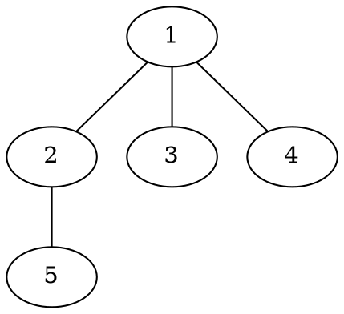

[[TOC]]

### 题意

给一棵多叉树，允许任意安排每个结点孩子的顺序，再按左孩子右兄弟表示法转成二叉树。

要求求出：

- 所有可能转化结果中
- 二叉树的最大高度

### 思路

先看一个可以直接验证想法的朴素解：

@include-code(./brute.cpp, cpp)

`brute.cpp` 对每个结点枚举孩子排列，直接按定义求最大高度。
这个方法完全正确，但只能做很小的数据。

关键观察是：

如果结点 `u` 有 `k` 个孩子，那么某个孩子若排在第 `i` 个位置，它最终对高度的贡献是：

`1 + i + dp[child]`

其中：

- `1` 来自左孩子边
- `i` 来自它前面那些右兄弟边

所以如果我们想让高度尽量大，显然应该把“子树最高”的那个孩子放到最后。

于是立刻得到转移：

- 叶子：`dp[u] = 0`
- 非叶子：`dp[u] = 儿子数 + max(dp[child])`

因为题目保证父亲编号小于儿子编号，所以我们甚至不用 DFS 排序，直接从 `n` 倒着算到 `1` 就行。

样例树可以画成这样：

这里根 `1` 有 3 个孩子。
为了让高度最大，应该把“还带着一个孩子 `5`” 的结点 `2` 放在兄弟链最后。
这样它能多吃到最多的右兄弟边，所以最终答案是 `4`。

### 代码

@include-code(./main.cpp, cpp)

### 复杂度

整棵树只需要线性扫描一次。

时间复杂度是 `O(n)`，空间复杂度是 `O(n)`。

### 总结

这题最核心的一句话就是：

- 最深的那棵子树，应该放到最后一个兄弟位置

一旦看清这一点，整题就会化成一个非常短的树形 DP。
