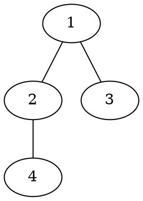

[[TOC]]

### 题意

给一棵 `n` 个点的树，每个点代表一台电脑。

如果一台电脑直接连了 `d` 根网线，那么信息每经过这台电脑一次，就会产生 `d` 单位时间延迟。

查询很多次：

- 从电脑 `u` 向电脑 `v` 发送信息
- 最短时间是多少

因为原图是一棵树，所以 `u` 到 `v` 的路径唯一，最短时间就是：

- 这条路径上所有点的延迟之和

这里发送点和接收点也要算一次；如果 `u = v`，那就只算这一个点本身的延迟。

#### 样例树

样例树结构如下：

各点度数分别是：

- `deg[1] = 2`
- `deg[2] = 2`
- `deg[3] = 1`
- `deg[4] = 1`

比如查询 `2 -> 3`，路径是 `2-1-3`，答案就是：

- `2 + 2 + 1 = 5`

### 思路

先看一个最直接的小数据暴力：

@include-code(./brute.cpp, cpp)

暴力做法就是：

1. 每次查询在树上找出 `u` 到 `v` 的唯一路径
2. 把路径上所有点的度数累加起来

这个方法很直观，但查询多的时候，每次都重新找路径会慢。

关键观察是：

- 题目本质上就是“树上路径点权和”
- 每个点的点权固定等于它的度数

于是可以把题目转成一个标准模型：

1. 任选 `1` 为根
2. 设 `prefix_sum[u]` 表示从根到 `u` 的路径点权和
3. 对于两点 `u, v`，它们路径和可以用 LCA 拆出来

设 `p = lca(u, v)`，那么：

- 根到 `u` 的路径和是 `prefix_sum[u]`
- 根到 `v` 的路径和是 `prefix_sum[v]`
- 根到 `p` 的那一段被重复算了两次

所以答案是：

`prefix_sum[u] + prefix_sum[v] - 2 * prefix_sum[p] + deg[p]`

最后为什么还要加回 `deg[p]`？

因为：

- `prefix_sum[p]` 被减了两次
- 但 LCA 点本身在真实路径里应该保留一次

因此只要预处理好：

- 每个点的度数
- 每个点到根的路径和
- 倍增 LCA

每次询问就能在 `O(log n)` 内回答。

### 代码

@include-code(./main.cpp, cpp)

### 复杂度

预处理：

- 建树和点度数统计：`O(n)`
- 倍增祖先表：`O(n log n)`

每次查询：

- 求一次 LCA：`O(log n)`

空间复杂度：

- `O(n log n)`

### 总结

这题虽然题面说的是“网络传输时间”，但真正落到算法上只有一句话：

- 路径代价 = 路径上所有点的度数和

一旦看成树上路径点权和，就会自然想到：

1. 根到点前缀和
2. LCA 拆路径

所以它本质是一道很标准的：

- `倍增 LCA + 路径点权和`

的树上查询题。
