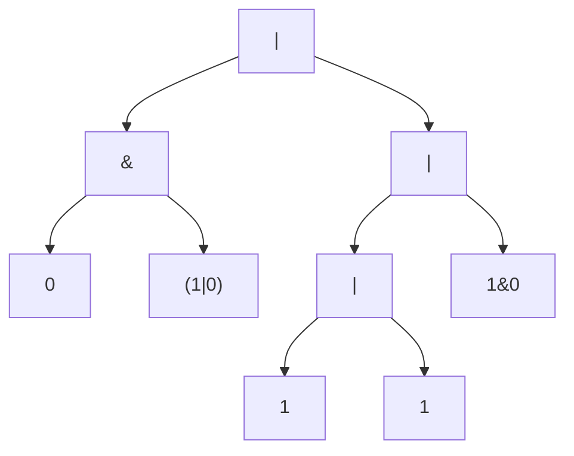

[[TOC]]

### 题意

给出一个只包含 `0`、`1`、`&`、`|`、括号的合法逻辑表达式。

需要输出：

1. 表达式最终的值
2. 形如 `a&b` 的短路次数
3. 形如 `a|b` 的短路次数

题目规定括号优先，`&` 高于 `|`，同级从左到右计算。

### 思路

最直接的办法是按文法递归下降解析，并在解析过程中按短路语义求值。

先看一个可以直接验证想法的朴素解：

@include-code(./brute.cpp, cpp)

`brute.cpp` 用 `parse_or / parse_and / parse_factor` 描述整个文法，并在发生短路时用 `skip_*` 函数把右侧子表达式整体跳过。这个版本很适合理解题意和对拍。

正式解的问题在于：表达式长度能到 `10^6`，递归解析和递归求值都可能爆栈。

#### 样例语法树

这张图展示样例 `0&(1|0)|(1|1|1&0)` 对应的主要语法结构：

从图里可以看到，短路求值本质上就是“先看左儿子，再决定要不要进右儿子”。
例如左边的 `0&(1|0)`，只要看到左儿子是 `0`，就能直接确定整棵 `&` 子树结果为 `0`，右边整块都不会被访问。
因此右子树内部的任何短路，也都不该被统计。

所以正式解分成两步：

1. 先用运算符栈按优先级把中缀表达式建成语法树
2. 再用显式栈模拟递归求值过程

求值时：

- 先处理左子树
- 若当前是 `&` 且左值为 `0`，统计一次 `&` 短路并直接返回
- 若当前是 `|` 且左值为 `1`，统计一次 `|` 短路并直接返回
- 否则继续处理右子树，再合并最终值

这样既满足短路定义，也避免了深递归。

### 代码

@include-code(./main.cpp, cpp)

### 复杂度

建树和求值都只会对每个字符或节点做常数次处理，所以总时间复杂度是 `O(|s|)`，空间复杂度也是 `O(|s|)`。

### 总结

这题的关键不是普通表达式求值，而是“短路会让整棵右子树失去访问资格”。把表达式显式建成语法树后，这个限制就会变得很自然。
