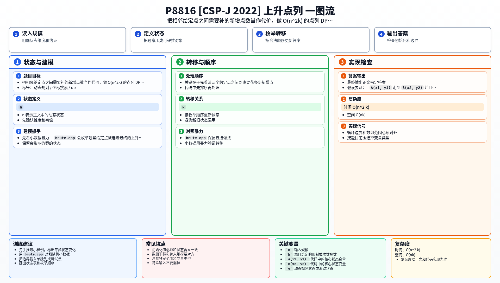

[[TOC]]

### 题意

给出 `n` 个整数点，还允许你额外添加 `k` 个整数点。

要求从这些点里选出一个序列，使得相邻两点距离恰好为 `1`，并且坐标都单调不减。也就是说，每一步只能：

- 向右走一格
- 或向上走一格

问这样的点列最大能有多长。

### 思路

先看小数据暴力：

@include-code(./brute.cpp, cpp)

`brute.cpp` 会枚举哪些给定点被选进最终的上升点列，只要下一个点坐标不下降，并且连接它所需的新增点数还没超预算，就继续 DFS。

关键在于先看清两个给定点之间到底要花多少新增点。

假设要从：

- `A(x1, y1)` 走到 `B(x2, y2)`

并且 `x2 >= x1, y2 >= y1`。

因为每一步只能向右或向上，所以总步数固定是：

- `(x2-x1) + (y2-y1)`

而这段路的两个端点已经是给定点，所以中间真正需要补上的新增点数就是：

- `(x2-x1) + (y2-y1) - 1`

#### 两点代价表

| 起点到终点 | 总步数 | 需要补的新增点数 |
| --- | --- | --- |
| `(1,2) -> (3,2)` | `2` | `1` |
| `(3,3) -> (3,4)` | `1` | `0` |
| `(2,2) -> (5,5)` | `6` | `5` |

接下来有个很关键的化简：

如果一条路径里一共选了 `g` 个给定点，并且为了把它们连起来已经用了 `t` 个新增点，那么这条路径当前长度就是：

- `g + t`

而剩下的 `k-t` 个新增点总能继续接到路径两端，再把长度增加 `k-t`。

所以最终总长度恒为：

- `g + k`

也就是说，题目本质上变成了：

- **在新增点消耗不超过 `k` 的前提下，最多能选多少个给定点**

于是做 DP。

先按 `(x 升序, y 升序)` 排序，设：

- `dp[i][t]` 表示以第 `i` 个给定点结尾，恰好用了 `t` 个新增点时，最多能选多少个给定点

若 `j` 能接在 `i` 后面，就计算：

- `need = (x_j-x_i) + (y_j-y_i) - 1`

然后转移：

- `dp[j][t+need] = max(dp[j][t+need], dp[i][t] + 1)`

最后找到最多能选到的给定点数 `best`，答案就是：

- `best + k`

#### DP 公式

两个给定点 $i,j$ 能相连时，所需新增点数为：

$$
need(i,j)=(x_j-x_i)+(y_j-y_i)-1
$$

设 $dp_{i,t}$ 表示以第 $i$ 个给定点结尾，恰好用了 $t$ 个新增点时，最多能选到多少个给定点。若 $x_j\ge x_i$ 且 $y_j\ge y_i$，则：

$$
dp_{j,t+need(i,j)}=\max(dp_{j,t+need(i,j)},\ dp_{i,t}+1)
$$

设 $best=\max_{i,0\le t\le k}dp_{i,t}$，最终答案为：

$$
best+k
$$

公式解释：两个给定点之间的曼哈顿步数固定，中间缺多少整数点也随之固定。`dp_{i,t}` 记录在新增点预算消耗为 `t` 时最多选了多少给定点；剩余新增点总能继续补在路径末端，所以最终长度再统一加上 `k`。

### 代码

@include-code(./main.cpp, cpp)

### 复杂度

- 时间复杂度：`O(n^2 k)`
- 空间复杂度：`O(nk)`

### 总结

这题最重要的化简是：

- 先把“路径总长度”转成“选中给定点个数 + k”

这样新增点就只剩下“作为代价连接给定点”的作用，整题自然落到一个带资源限制的点列 DP 上。

### 一图流解析

这张图把本题的建模、关键转移、实现检查和训练方法压缩到一页，适合读完正文后复盘。

