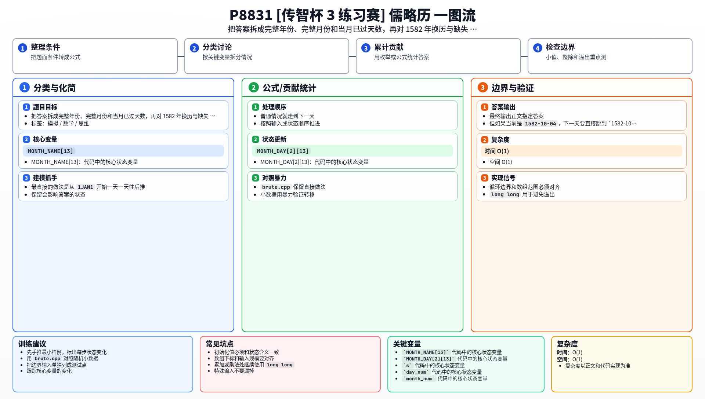

[[TOC]]

### 题意

给一个日期，要求计算它距离 `1JAN1` 已经过了多少天。

这里的“经过了多少天”指的是：从 `1JAN1` 走到这个日期之前，一共经历了多少个真实存在的日期，所以 `1JAN1` 的答案是 `0`。

题目有两个特殊规则：

1. `1582` 年之前按儒略历算闰年：`4` 的倍数就是闰年；
2. 从 `1582` 年开始改成新的规则，并且 `1582-10-04` 的下一天直接是 `1582-10-15`。

这个跳转最容易出错，可以先记住：

| 当前日期 | 下一天 |
| --- | --- |
| `4OCT1582` | `15OCT1582` |

也就是说 `1582-10-05` 到 `1582-10-14` 这 `10` 天根本不存在，统计天数时不能把它们算进去。

### 思路

最直接的做法是从 `1JAN1` 开始一天一天往后推。

普通情况就走到下一天；但如果当前是 `1582-10-04`，下一天要直接跳到 `1582-10-15`。

这个版本最贴近题意，也最容易帮助读者理解题目的特殊规则：

@include-code(./brute.cpp, cpp)

但如果目标年份很大，这样逐天模拟显然太慢。

我们真正要算的，其实只是“目标日期前面一共有多少天”，所以可以直接分三段统计：

1. 目标年份之前的完整年份；
2. 当前年份中，目标月份之前的完整月份；
3. 当前月份里，目标日期之前已经过去的天数。

#### 先算完整年份

如果目标年份 `y <= 1582`，那么前面的完整年份都按儒略历处理，闰年个数就是：

`(y - 1) / 4`

所以这一部分天数是：

`365 * (y - 1) + (y - 1) / 4`

如果 `y > 1582`，就拆成三段：

1. `1..1581`：按儒略历统计；
2. `1582`：这一年实际只有 `355` 天；
3. `1583..y-1`：按格里高利历统计。

格里高利历中，`1..n` 的闰年个数可以用：

`n / 4 - n / 100 + n / 400`

直接算出来。

#### 再算完整月份

这一部分和普通日期题差不多：

- 先根据当前年份判断二月是 `28` 天还是 `29` 天；
- 再把当前月之前的月份天数累加起来。

注意 `1582` 年本身不是闰年，所以这里不会遇到额外麻烦。

#### 最后算当前月已过天数

这一部分就是 `day - 1`。

#### 处理删掉的 10 天

如果日期在 `1582` 年内，并且不早于 `1582-10-15`，那么它前面那 `10` 个不存在的日期原本会被普通公式算进去，所以最后要减去 `10`。

如果年份已经大于 `1582`，这 `10` 天已经被算进“前面完整年份”的 `355` 天里了，不能重复减。

这样就得到了最终答案。

### 代码

@include-code(./main.cpp, cpp)

### 复杂度

- 时间复杂度：`O(1)`
- 空间复杂度：`O(1)`

### 总结

这题的关键不是逐天模拟，而是把答案拆成“完整年份 + 完整月份 + 当前月已过天数”。

真正需要单独处理的只有两件事：

1. `1582` 年前后闰年规则不同；
2. `1582-10-05` 到 `1582-10-14` 不存在，所以换历后的日期要额外减去 `10` 天。

### 一图流解析

这张图把本题的建模、关键转移、实现检查和训练方法压缩到一页，适合读完正文后复盘。

