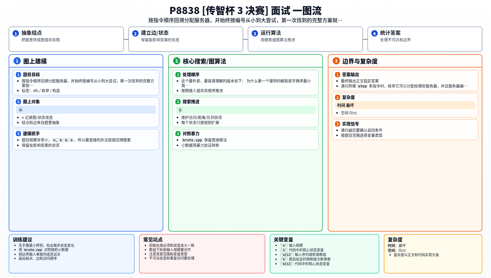

[[TOC]]

### 题意

有 `n` 个服务器，第 `i` 个服务器最多能处理大小为 `a[i]` 的数据。

接下来按顺序有 `k` 条指令，第 `i` 条指令需要处理大小为 `b[i]` 的数据。每条指令都必须分配给一个还没被用过的空闲服务器，而且这个服务器的容量要不小于 `b[i]`。

要求输出一个分配序列 `p[1..k]`，表示第 `i` 条指令分给服务器 `p[i]`，并且这个序列要字典序最小。如果根本无法完成分配，就输出 `-1`。

### 思路

题目规模非常小，`n, k <= 6`，所以最直接的办法就是回溯搜索。

这个最朴素、最容易理解的版本如下：

@include-code(./brute.cpp, cpp)

#### 为什么第一个搜到的解就是字典序最小

我们按指令顺序递归。

递归到第 `step` 条指令时，枚举它可以分配给哪些服务器，并且服务器编号从小到大尝试。

这样搜索树的遍历顺序就是：

- 先尽量让 `p[1]` 小；
- 在 `p[1]` 固定后，再尽量让 `p[2]` 小；
- 依次类推。

所以第一次找到的完整合法方案，天然就是字典序最小的方案。

#### 搜索怎么写

设 `used[i]` 表示服务器 `i` 是否已经被占用。

当前处理第 `step` 条指令时：

1. 枚举服务器 `1..n`；
2. 如果这个服务器还空闲，且 `a[i] >= b[step]`，就可以尝试分配；
3. 标记已使用，递归下一条指令；
4. 如果后面能成功，就直接结束；
5. 否则回溯撤销标记。

如果所有可能都试完还不成功，说明无解。

### 代码

@include-code(./main.cpp, cpp)

### 复杂度

- 时间复杂度：最坏 `O(n!)`
- 空间复杂度：`O(n)`

但这里 `n <= 6`，这个复杂度完全足够。

### 总结

这题的关键不是优化，而是看出“字典序最小”正好可以通过搜索顺序直接保证。

只要按服务器编号从小到大回溯，找到的第一个完整解就是答案。

### 一图流解析

这张图把本题的建模、关键转移、实现检查和训练方法压缩到一页，适合读完正文后复盘。

