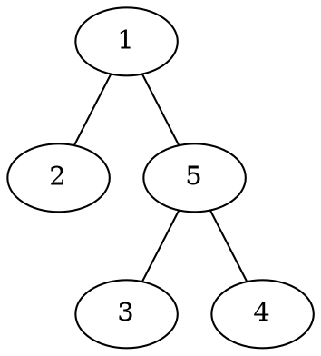
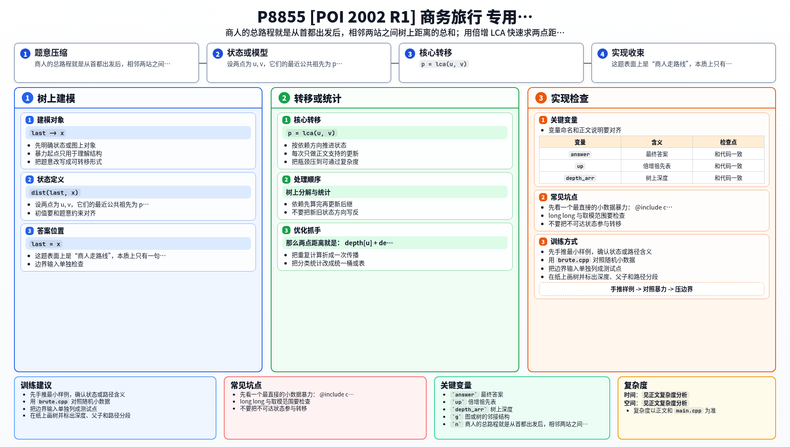

[[TOC]]

### 题意

给一棵树，首都编号为 `1`。

商人从首都出发，接下来要按给定顺序依次去若干个城镇做生意。

树上每条边的长度都是 `1`，要求输出：

- 按这个顺序走完全部行程的最短总时间

因为图本身是一棵树，所以任意两点之间路径唯一，最短时间其实就是：

- 从当前城市到下一个城市的树上距离

把这些相邻路段全部加起来。

#### 样例图

样例树结构如下：

路线是：

`1 -> 3 -> 2 -> 5`

对应路程分别是：

- `1 -> 3`：2
- `3 -> 2`：3
- `2 -> 5`：2

总和就是 `7`。

### 思路

先看一个最直接的小数据暴力：

@include-code(./brute.cpp, cpp)

暴力做法就是：

1. 当前在 `last`
2. 下一站是 `x`
3. 直接在树上找出 `last -> x` 的唯一路径长度
4. 把所有相邻两站距离累加

这个方法很好理解，但如果每一段都重新搜路径，就会慢。

真正需要高效解决的，其实只有一个子问题：

- 如何快速求树上两点距离

这正是 LCA 的标准应用。

设两点为 `u, v`，它们的最近公共祖先为 `p = lca(u, v)`。

那么两点距离就是：

`depth[u] + depth[v] - 2 * depth[p]`

所以整道题分成两步：

1. 预处理倍增 LCA
2. 顺着给定路线，把相邻两站的距离加起来

由于商人从首都出发，所以初始位置直接设成：

- `last = 1`

后面每读到一个目的地 `x`，就：

1. 累加 `dist(last, x)`
2. 再令 `last = x`

### 代码

@include-code(./main.cpp, cpp)

### 复杂度

预处理倍增祖先表：

- `O(n log n)`

每次求一段距离：

- `O(log n)`

总共有 `m` 段行程，所以总复杂度：

- `O(n log n + m log n)`

空间复杂度：

- `O(n log n)`

### 总结

这题表面上是“商人走路线”，本质上只有一句话：

- 把整段路线拆成很多个相邻两站之间的树上距离

一旦看出这一点，后面就是标准模板：

1. 倍增求 LCA
2. 用深度算两点距离
3. 顺序累加

所以它本质是一道很纯的：

- `LCA 求距离`

的入门应用题。

### 一图流解析

这张图把本题的建模、关键转移、实现检查和训练方法压缩到一页，适合读完正文后复盘。

