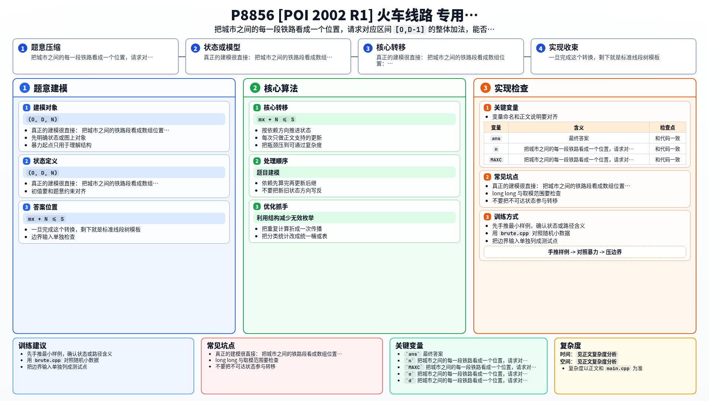

[[TOC]]

### 题意

火车从 `1` 号城市开到 `C` 号城市，一共有 `S` 个座位。

现在有 `R` 个订票请求，每个请求是：

- 上车站 `O`
- 下车站 `D`
- 需要 `N` 个座位

按顺序处理这些请求。

如果这批乘客经过的整段路线都还能塞下 `N` 个座位，就接受这单；否则拒绝。

输出：

- `T` 表示接受
- `N` 表示拒绝

### 思路

先看一个最容易理解的暴力：

@include-code(./brute.cpp, cpp)

`brute.cpp` 直接维护每一段铁路当前被占了多少座位。

对于请求 `(O, D, N)`：

- 先扫描 `[O, D-1]`，看最大占用是多少
- 若还能装下，再把这段全部加上 `N`

这个思路完全正确，但每次都扫整段，复杂度太高。

真正的建模很直接：

把城市之间的铁路段看成数组位置：

- 第 `i` 个位置表示城市 `i` 到 `i+1` 这一段铁路

那么一个请求 `(O, D, N)` 就会影响区间：

`[O, D-1]`

而能否接受，只取决于这段区间里当前的最大占用 `mx`：

- 若 `mx + N <= S`，说明整段铁路都还能装下这批乘客
- 否则至少有一段超载，必须拒绝

于是题目就变成了标准的：

- 区间最大值查询
- 区间加法修改

用懒标记线段树维护即可。

### 代码

@include-code(./main.cpp, cpp)

### 复杂度

每个请求需要：

- 一次区间最大值查询
- 最多一次区间加法修改

所以单次复杂度：

`O(log C)`

总时间复杂度：

`O(R log C)`

空间复杂度：

`O(C)`

### 总结

这题最核心的点是把“城市区间订票”转成“铁路段数组上的区间容量维护”。

一旦完成这个转换，剩下就是标准线段树模板。

### 一图流解析

这张图把本题的建模、关键转移、实现检查和训练方法压缩到一页，适合读完正文后复盘。

