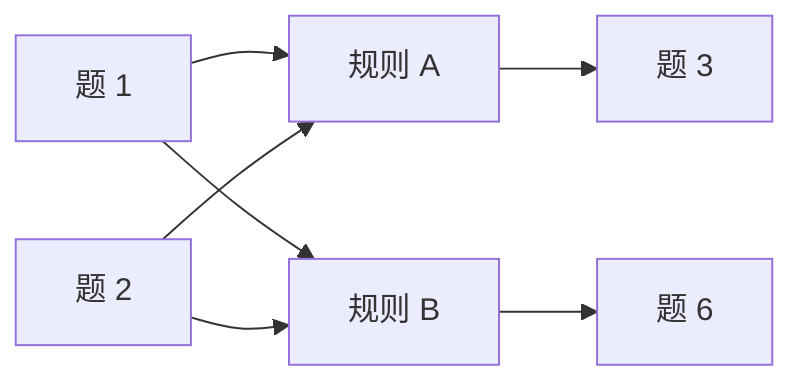

[[TOC]]

### 题意

有一些题在第 `0` 天就会被推荐。

之后每条规则都形如：如果集合 `S` 中的题都已经做完，并且其中至少有一道题是“今天刚做的”，那么下一天会推荐目标题 `v`。

问最早第几天能做完第 `K` 题；若做不到输出 `-1`。

### 思路

#### 状态图

这张图把“题集触发一条规则，再推荐目标题”的关系画出来：

图里的 `规则 A / 规则 B` 不是题，而是“依赖集合已经全部满足”的条件节点。
当某条规则的所有前提题都完成时，就能在下一天得到它指向的目标题。

先看一个小数据暴力：

@include-code(./brute.cpp, cpp)

暴力做法把状态写成 `(已经做完的题集合, 已经被推荐过的题集合)`，按天 BFS，并枚举今天做哪些题。它适合小数据对拍，但正式数据显然不能这么做。

这题真正该抓的是“每道题最早在哪一天完成”。

设 `day[x]` 表示题 `x` 的最早完成天数。

如果一条规则依赖集合为 `S`，那么它最早什么时候触发？

- 只有 `S` 中所有题都做完才能触发；
- 最早满足这一点的那一天，就是 `S` 里最后完成的那道题完成的那一天；
- 也就是 `max(day[u])`。

并且达到这个最大值的那道题，天然就满足题意里的“今天刚做过一题”。

所以目标题 `v` 的最早完成天数就是：

`max(day[u]) + 1 , u in S`

于是整题可以改写成一个单调传播问题：

1. 初始推荐题的完成天数都是 `0`。
2. 对每条规则维护：
   - 还有多少个前提题没完成；
   - 已完成前提题里的最大完成天数。
3. 每当一题 `u` 的最早完成天数确定，就去更新所有依赖 `u` 的规则。
4. 某条规则一旦所有前提齐了，就能推出目标题的最早完成天数。

这和拓扑排序很像，只不过“边”变成了“一个题集指向一条规则，再指向目标题”。

### 代码

@include-code(./main.cpp, cpp)

### 复杂度

设所有规则依赖集合大小之和为 `S`，时间复杂度 `O(N + R + S)`，空间复杂度 `O(N + R + S)`。

### 总结

这题难点在于它不是普通边图，而是“一个目标依赖一组前提”的超边模型。只要把规则单独看成节点，维护前提数量和前提最大完成天数，整个过程就能像拓扑传播一样一次做完。
