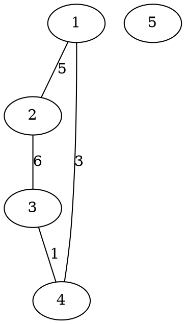

[[TOC]]

### 题意

给一张无向带权图。

一条路径的稳定性定义为：

- 这条路径上所有边权的最小值

两点 `A, B` 之间的通信稳定性定义为：

- 所有 `A -> B` 路径里，稳定性最大的那一条

也就是典型的：

- 最大化路径最小边权

如果两点根本不连通，输出 `-1`。

#### 样例图

样例图如下：

例如 `2 -> 4`：

- 路径 `2-3-4` 的稳定性是 `min(6,1)=1`
- 路径 `2-1-4` 的稳定性是 `min(5,3)=3`

所以最优答案是 `3`。

### 思路

先看一个最直接的小数据暴力：

@include-code(./brute.cpp, cpp)

`brute.cpp` 用的是经典的 maximin Floyd：

- `dist[i][j]` 表示 `i` 到 `j` 的最大瓶颈值
- 转移是 `dist[i][j] = max(dist[i][j], min(dist[i][k], dist[k][j]))`

这个思路完全正确，但 `n` 到 `1e5` 时显然不可能跑 Floyd。

关键观察是：

- 这题问的“最大化路径最小边权”，等价于最大生成树上的路径最小边权

原因和最小生成树里常见的瓶颈路性质一样，只不过这里用的是：

- 最大生成森林

具体地说：

1. 按边权从大到小做 Kruskal
2. 得到一片最大生成森林
3. 如果两点不在同一棵树里，答案就是 `-1`
4. 如果在同一棵树里，答案等于它们在这棵树上唯一路径的最小边权

所以整题的难点只剩下：

- 如何快速求树上两点路径最小边权

这就是标准的倍增 LCA 扩展。

除了祖先表 `up[u][j]` 之外，再维护：

- `min_edge[u][j]`：从 `u` 往上跳 `2^j` 层，这段路径上的最小边权

查询时：

1. 先把深的点提到同一层，并更新答案最小值
2. 再让两个点一起往上跳
3. 最后把到 LCA 下面那两条边也算进去

这样每次查询就是 `O(log n)`。

### 代码

@include-code(./main.cpp, cpp)

### 复杂度

预处理：

- Kruskal 建最大生成森林：`O(m log m)`
- 倍增预处理：`O(n log n)`

每次查询：

- `O(log n)`

空间复杂度：

- `O(n log n + m)`

### 总结

这题的核心不是最短路，而是瓶颈路。

真正要记住的一句话是：

- 两点间“最大化路径最小边权”的答案，可以放到最大生成森林上去查

于是整题自然分成两层：

1. 并查集 + Kruskal 建最大生成森林
2. 倍增 LCA 查询树上路径最小边权

本质上是一道非常标准的：

- `最大生成树性质 + LCA`

组合题。
