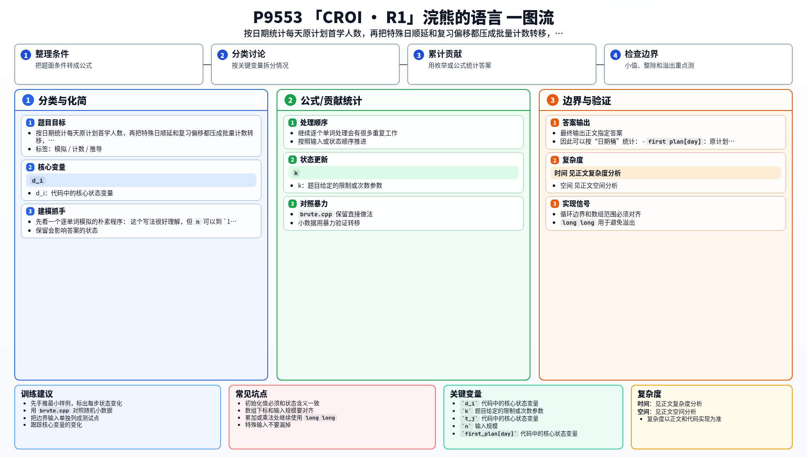

[[TOC]]

### 题意

每个单词有一个原计划首次学习日 `d_i`，以及固定的 `k` 个复习偏移 `t_j`。

如果某个学习或复习事件落在特殊日，就要顺延到后面第一个非特殊日。题目要求输出最后一天，以及每天新学和复习的数量。

#### 样例过程表

这张表展示样例 3 中，特殊日如何把事件推迟：

| 天数 | 新学数量 | 复习数量 |
| --- | --- | --- |
| 1 | 1 | 0 |
| 2 | 1 | 1 |
| 3 | 0 | 0 |
| 4 | 2 | 4 |

这里最关键的是第 `3` 天为特殊日，所以原本落在这一天的事件都会整体顺延到第 `4` 天。

### 思路

先看一个逐单词模拟的朴素程序：

@include-code(./brute.cpp, cpp)

这个写法很好理解，但 `n` 可以到 `10^6`。继续逐个单词处理会有很多重复工作。

注意到题目给了两个很重要的限制：

- `d_i <= 1000`
- `t_j <= 1000`

也就是说，真正会涉及的日期范围不大，而且同一天原计划首次学习的所有单词，之后的复习安排完全相同。

因此可以按“日期桶”统计：

- `first_plan[day]`：原计划在这天首次学习的人数；
- `learn[day]`：真实在这天首次学习的人数；
- `review[day]`：真实在这天复习的人数。

再预处理 `next_day[day]`，表示从 `day` 开始往后第一个非特殊日。

做法分两步：

1. 扫描 `first_plan`：
   - 如果当天是特殊日，就把这一天的人数整批推到下一天；
   - 否则它们全部成为 `learn[day]`。
2. 对每个 `learn[day]` 和每个复习偏移 `t_j`：
   - 先看原计划复习日 `day + t_j`；
   - 再通过 `next_day` 找到真实复习日；
   - 把这批人数加到 `review[target]`。

这样就把逐单词的重复操作压成了按日期的批量加法。

### 代码

@include-code(./main.cpp, cpp)

### 复杂度

设有效日期范围为 `D`，时间复杂度 `O(D * k)`，空间复杂度 `O(D)`。

### 总结

这题看上去像事件模拟，真正的突破点是把“单词”换成“日期计数桶”。相同计划日的一批单词会一起移动，这样就能避免处理一百万个独立对象。

### 一图流解析

这张图把本题的建模、关键转移、实现检查和训练方法压缩到一页，适合读完正文后复盘。

