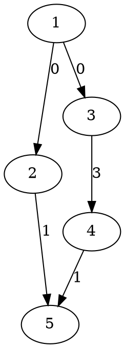

[[TOC]]

### 题意

给出一个有向图，边有开放时间。游客只能在时间是 `k` 的倍数时进出景区，进入后不能停留，只能一直沿边走，每条边要在不早于其开放时间时通过。

要求最早离开景区的时刻。

### 思路

最直接的办法是按时间模拟或者枚举起步时刻。

先看一个可以直接验证想法的朴素解：

@include-code(./brute.cpp, cpp)

`brute.cpp` 在小图上直接按状态图做朴素松弛，适合对拍，但正式数据下还是应该用 Dijkstra。

关键观察是：虽然不能在图里原地等待，但我们可以把“乘坐入口巴士的时刻”整体往后推迟若干个 `k`。这样整条前缀路径上经过每条边的时刻都会同时增加 `k` 的倍数，所有时刻对 `k` 的余数保持不变。

因此状态只需要记录：

- 当前在哪个点
- 当前时刻对 `k` 的余数

这张图展示样例 1 的小图：

从图里可以看出，虽然 `1 -> 2 -> 5` 路径更短，但它的总长度不是 `k=3` 的倍数，不能直接作为最终方案；而 `1 -> 3 -> 4 -> 5` 长度正好是 `3`，只要把起步时刻推迟到 `3`，就能满足中间边 `3 -> 4` 的开放时间限制，最终在 `6` 时刻离开。

因此设 `dist[u][r]` 表示到达点 `u` 且当前时刻 `mod k = r` 时的最早真实时刻。在状态 `(u, r)` 上走一条开放时间为 `a` 的边时，如果当前时刻还没到 `a`，就把真实时刻向上补到不早于 `a` 且余数仍为 `r` 的最早值，然后再走这条边。

最后答案就是 `dist[n][0]`，因为离开景区时刻也必须是 `k` 的倍数。

### 代码

@include-code(./main.cpp, cpp)

### 复杂度

状态数是 `n * k`，在状态图上跑 Dijkstra，总时间复杂度大致是 `O((n*k + m*k) log(n*k))`，空间复杂度是 `O(n*k + m)`。

### 总结

这题的关键不在于直接模拟时间，而在于抓住“起步时间可以整体延后 `k` 的倍数”这一点。把状态写成 `(点, 时间 mod k)` 后，就是一个标准的状态最短路。

### 一图流解析

这张图把本题的建模、关键转移、实现检查和训练方法压缩到一页，适合读完正文后复盘。

