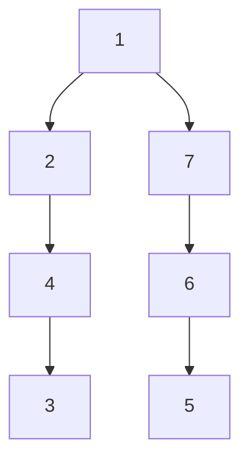
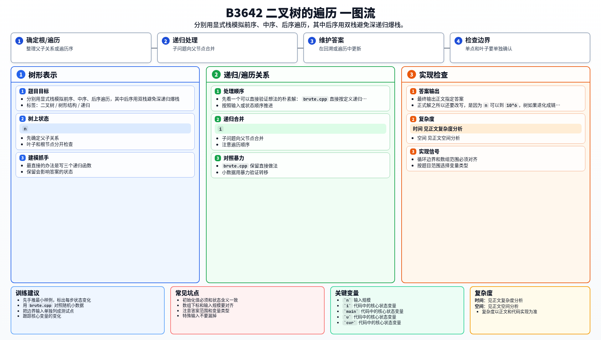

[[TOC]]

### 题意

给出一棵以 `1` 为根的二叉树，要求依次输出它的：

- 前序遍历
- 中序遍历
- 后序遍历

### 思路

最直接的办法是写三个递归函数。

先看一个可以直接验证想法的朴素解：

@include-code(./brute.cpp, cpp)

`brute.cpp` 直接按定义递归，写法最短，也最容易理解。

正式解之所以还要改写，是因为 `n` 可以到 `10^6`，树如果退化成链，递归深度会非常危险。

#### 样例树

这张图展示样例树的结构：

对着这张图看：
- 前序是根先走，所以得到 `1 2 4 3 7 6 5`
- 中序是左边走完再记根，所以得到 `4 3 2 1 6 5 7`
- 后序是左右都走完再记根，所以得到 `3 4 2 5 6 7 1`

为了避免递归爆栈，正式解把三种遍历都改成显式栈：

1. 前序：先压右，再压左
2. 中序：模拟“一路向左深入”
3. 后序：用双栈先得到“根右左”，再反过来输出成“左右根”

### 代码

@include-code(./main.cpp, cpp)

### 复杂度

每个节点都只被访问常数次，所以总时间复杂度是 `O(n)`，空间复杂度是 `O(n)`。

### 总结

这题本身是基础遍历题，但数据范围提醒我们要注意实现方式。树很深时，递归和显式栈的差别会直接决定程序能不能过。

### 一图流解析

这张图把本题的建模、关键转移、实现检查和训练方法压缩到一页，适合读完正文后复盘。

